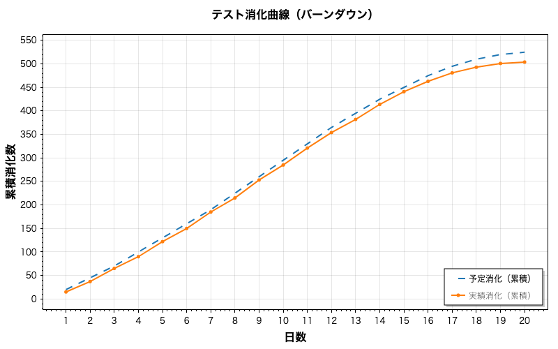
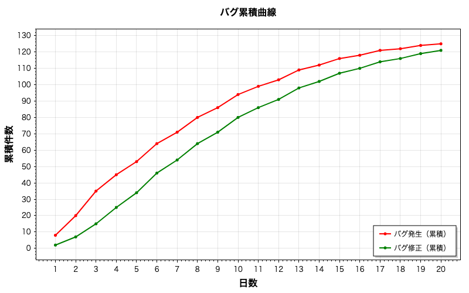
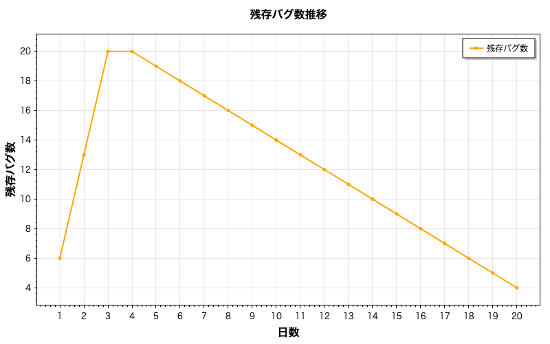
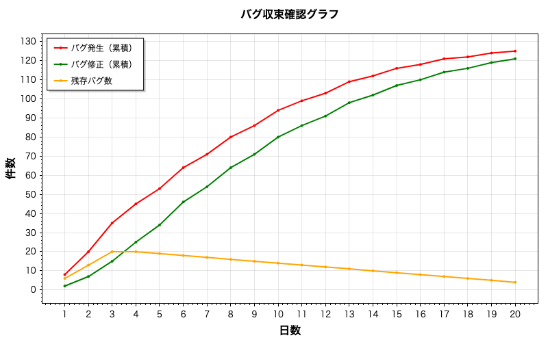
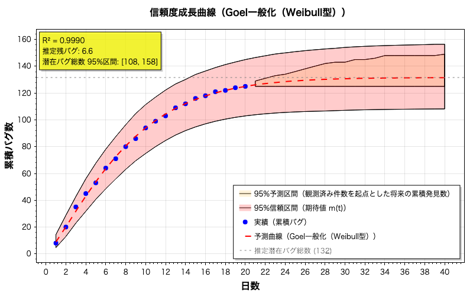

# バグ収束推定ツール (Bug Convergence Tool)

バイブコーディングで開発したツール。
.NET 10で実装されたソフトウェアテスト品質分析のためのコマンドラインツールです。  
信頼度成長モデル（SRGM）を用いて、バグの収束状況を分析し、リリース判断に役立つ情報を提供します。

## 特徴

### 基本機能

- **5種類の基本信頼度成長モデル**（指数型、遅延S字型、ゴンペルツ（切断型）、Goel一般化（Weibull型）、変曲S字型）
- **拡張モデル**（変化点、テスト工数関数（TEF）、欠陥除去効率（FRE））
- **収束予測日の計算**（90%/95%/99%/99.9%発見予測）
- **収束判断の目安**（現在の発見率に基づく★評価）
- **グラフ画像出力**（PNG形式）
- **Excel形式での結果出力**
- **詳細なテキストレポート**出力

### 推定・検証機能

- **損失関数の選択**: MLE（最尤推定、Poisson-NHPP。デフォルト）またはSSE（残差二乗和）
- **ホールドアウト検証**: 末尾N日を除いて別途推定し、末尾期間の発見数の予測誤差を評価（最終結果は全データで推定）
- **警告メッセージシステム**: データ品質やモデル選択に関する注意点を自動生成
- **AICc自動適用**: 小標本補正AICを自動判定・適用（Burnham & Anderson基準）。比較グループ内で基準を統一
- **比較グループ**: AIC は同じデータ・同じ尤度のモデル同士でのみ比較（FRE・TEF は別グループとして表示）
- **推定の安定性**: 末尾の日を除いて推定し直し、推定総バグ数が直近のデータにどれだけ依存するかを評価
- **堅牢な変化点検出**: プロファイル尤度法による客観的な変化点特定

### 統計診断・検証機能

- **残差診断**: 生残差・Pearson残差・Deviance残差・Anscombe残差の計算と分析
  - **自己相関検定**: Durbin-Watson検定、Ljung-Box Q検定
  - **正規性検定**: Jarque-Bera検定、Anderson-Darling検定
  - **ランテスト**: 残差の独立性検証
  - **Poisson整合性診断**: 過分散検定、ランダム化分位残差（Dunn & Smyth 1996）
- **適合度検定**: χ²検定、Kolmogorov-Smirnov検定、Cramér-von Mises検定
- **予測区間**: パラメトリック・ブートストラップによる将来の累積発見数・残りバグ数・収束日の区間
- **モデル平均化**: AIC（AICc）重み付けによるマルチモデル推論（Burnham & Anderson 2002）

### 高度な統計機能（v2.0新機能）

- **パラメトリック・ブートストラップ（Poisson再生成）**: NHPP仮定に整合したブートストラップ信頼区間
- **変化点の尤度比検定（LRT）**: 変化点の存在を統計的に検定（パラメトリック・ブートストラップによる p 値）
- **マルチスタート最適化**: Latin Hypercube Samplingによる多様な初期点からの大域的探索
- **Fisher情報行列ベースの信頼区間**: 解析的な漸近信頼区間の計算（NHPP対数尤度のヘッセ行列）

## 必要環境

- .NET 10.0 SDK / Runtime

## インストール

```bash
# ビルド
dotnet build -c Release

# 発行（単一実行ファイル）
dotnet publish -c Release -r win-x64 --self-contained -p:PublishSingleFile=true -p:PublishReadyToRun=true

# 単体テスト
dotnet test tests/BugConvergenceTool.Tests
```

## 使用方法

```bash
BugConvergenceTool <入力Excel> [オプション]
```

### オプション一覧

| オプション | 説明 |
|-----------|------|
| `-h`, `--help` | ヘルプを表示 |
| `-o`, `--output DIR` | 出力ディレクトリを指定（省略時は入力ファイルと同じディレクトリ） |
| `-c`, `--config FILE` | 設定ファイルを指定 |
| `-v`, `--verbose` | 詳細出力 |
| `--optimizer TYPE` | 最適化アルゴリズム（de/pso/gwo/cmaes/nm/grid/auto、デフォルト: de。不明な値は de） |
| `--change-point` | 変化点モデルを含める |
| `--tef` | テスト工数関数モデルを含める |
| `--fre` | 欠陥除去効率モデルを含める |
| `--all-extended` | 全拡張モデルを含める |
| `--ci`, `--confidence-interval` | 信頼区間を計算（パラメトリック・ブートストラップ。水準は設定ファイルの `Bootstrap.ConfidenceLevel`、デフォルト 95%） |
| `--bootstrap N` | ブートストラップ反復回数（デフォルト: 200。50 未満は 50 に切り上げ） |
| `--loss TYPE` | 損失関数を指定（mle/sse、デフォルト: mle。不明な値は注意を表示して mle） |
| `--holdout-days N`, `--holdout N` | 末尾N日をホールドアウト検証に使用 |
| `-d`, `--diagnostics` | 統計診断を実行（残差分析、自己相関、正規性、Poisson整合性、適合度検定） |
| `--pi`, `--prediction-interval` | 将来の累積発見数・残りバグ数・収束日の予測区間を計算（パラメトリック・ブートストラップ） |
| `--multi-start N` | N 個の開始点（Latin Hypercube Sampling）から並列に最適化（デフォルト: 1） |
| `--lrt-iterations N` | 変化点の尤度比検定のシミュレーション回数（デフォルト: 99、0 で省略） |
| `--ma`, `--model-averaging` | モデル平均化を実行（AIC/AICc 重み付け予測） |

- `--coverage`（擬似Coverageモデル、廃止）と `--basic-only` は互換性のため受け付けますが、注意を表示して無視します。
- 上の表にない `-` で始まる引数は無視します。
- 乱数シードは設定ファイルの `Bootstrap.RandomSeed` で指定します（[ブートストラップ設定](#ブートストラップ設定configjson)）。

### 使用例

```bash
# 基本的な使用法
BugConvergenceTool TestData.xlsx

# 出力先を指定
BugConvergenceTool TestData.xlsx -o ./output

# オプティマイザ指定
BugConvergenceTool TestData.xlsx --optimizer pso
BugConvergenceTool TestData.xlsx --optimizer auto -v

# 拡張モデル使用
BugConvergenceTool TestData.xlsx --change-point      # 変化点モデル
BugConvergenceTool TestData.xlsx --tef               # TEFモデル
BugConvergenceTool TestData.xlsx --fre               # FREモデル
BugConvergenceTool TestData.xlsx --all-extended      # 全拡張モデル
BugConvergenceTool TestData.xlsx --all-extended -v   # 詳細出力付き

# 信頼区間付き分析
BugConvergenceTool TestData.xlsx --ci                # 95%信頼区間を計算
BugConvergenceTool TestData.xlsx --ci --bootstrap 500  # 反復回数を増やして精度向上

# 損失関数とホールドアウト検証
BugConvergenceTool TestData.xlsx --loss sse          # 従来の SSE（残差二乗和）を使用
BugConvergenceTool TestData.xlsx --holdout-days 5    # 末尾5日でホールドアウト検証
BugConvergenceTool TestData.xlsx --loss mle --holdout-days 5 -v  # 組み合わせ

# 組み合わせ
BugConvergenceTool TestData.xlsx --optimizer auto --all-extended --ci --loss mle -o ./results -v

# 統計診断を実行
BugConvergenceTool TestData.xlsx -d                  # 残差診断・適合度検定

# 予測区間を計算
BugConvergenceTool TestData.xlsx --pi                # 予測区間（ブートストラップ）
BugConvergenceTool TestData.xlsx --pi --bootstrap 500  # 反復回数を増やす

# モデル平均化（マルチモデル推論）
BugConvergenceTool TestData.xlsx --ma                # AIC重み付け予測（重みと不確実性を表示）

# 総合分析
BugConvergenceTool TestData.xlsx --all-extended --loss mle --holdout-days 5 -d --pi --ma --ci -o ./results -v
```

## 入力Excelの形式

「データ入力」シートに以下の形式でデータを配置してください：

> **注意**:
> - **TEFモデル**を使用する場合は、「実績消化」の行に有効な工数データが必要です（「予定消化」は現在の状況・グラフの表示にのみ使用します）。
> - **FREモデル**を使用する場合は、「バグ修正」の行に有効な修正数データが必要です。

```text
        |  B   |  C   |  D   |  E   | ...
--------|------|------|------|------|----
行2     | プロジェクト名         |
行3     | 総テストケース数       |
行4     | テスト開始日           |
        |      |      |      |      |
行6     | 1/6  | 1/7  | 1/8  | 1/9  | ...  ← 日付
行7     |  20  |  25  |  25  |  30  | ...  ← 予定消化（日次）
行8     |  15  |  22  |  28  |  25  | ...  ← 実績消化（日次） ※TEFモデルで必須
行9     |   8  |  12  |  15  |  10  | ...  ← バグ発生（日次）
行10    |   2  |   5  |   8  |  10  | ...  ← バグ修正（日次） ※FREモデルで必須
```

- **日付の範囲**: 行6 を B 列から右へ読み、最初の空セルの手前までを日付の範囲とします（途中に空欄があると、それより右の列は読み込みません）。日付として読めないセルは、テスト開始日からの通し日で補います。
- **観測期間**: 「バグ発生」（行9）が入力されている最後の日までを観測期間とします。観測期間が 3 日未満の場合はエラーになります。予定消化だけを先の日付まで入力しておいても、未来の日は「バグ 0 件の観測日」として扱いません（以前は日付が続く限り読み込み、空欄を 0 件としていました）。観測期間内の空欄は 0 件として扱います（「バグ発生」の空欄のみ注意を表示し、他の行の空欄は注意なしで 0 とします）。`=IF(...,"")` のように空文字を返す数式セルも未入力とみなします。
- **時間軸**: モデルの時間はテスト実施日の通し番号（1, 2, 3, …日目）です。予測日付への換算は、観測期間内は入力された日付を使い、観測期間後は、観測日に土日が含まれなければ（期間が1週間以上の場合）土日を除いた営業日、そうでなければ暦日で延ばします。祝日は考慮しません（以前は開始日に日数を足していたため、土日を除いたデータでは予測日付がずれていました）。

## 出力ファイル

```text
output/
├── Result_YYYYMMDD_HHmmss.xlsx    # 計算結果Excel
├── Result_YYYYMMDD_HHmmss.txt     # テキストレポート
└── Charts_YYYYMMDD_HHmmss/
    ├── test_progress.png          # テスト消化曲線
    ├── bug_cumulative.png         # バグ累積曲線
    ├── remaining_bugs.png         # 残存バグ推移
    ├── bug_convergence.png        # バグ収束確認グラフ
    └── reliability_growth.png     # 信頼度成長曲線
```

### 出力イメージ

`Templates/Template.xlsx` のサンプルデータ（20日分）を `--ci --pi` 付きで実行した出力です。

#### コマンドライン出力（抜粋）

```text
=== 現在の状況 ===

テスト消化（予定）: 525 / 500 (105.0%)
テスト消化（実績）: 504 / 500 (100.8%)
累積バグ発生数:     125 件
累積バグ修正数:     121 件
残存バグ数:         4 件

=== モデル比較結果 ===

【比較グループ: 発見数】日次バグ発見数のみの尤度
モデル名                     カテゴリ               R²       AICc      ΔAICc       潜在バグ
----------------------------------------------------------------------------------------
Goel一般化（Weibull型） *    基本               0.9990      82.59       0.00      131.6
ゴンペルツ（切断型）         基本               0.9989      83.30       0.71      131.8
変曲S字型（Ohba）            基本               0.9989      83.48       0.90      131.0
指数型（Goel-Okumoto）       基本               0.9930      84.13       1.54      144.3
遅延S字型                    基本               0.9882      86.58       3.99      128.6

* = 推奨モデル（比較グループ「発見数」内でAICc最小、損失関数: MLE）
  （小標本補正: n=20 に対し n/k < 40 のモデルがあるため、グループ内は AICc で統一）

=== 収束予測（Goel一般化（Weibull型））===

推定潜在バグ総数: 131.6 件
残り推定バグ数: 6.6 件
使用損失関数: MLE
推定の安定性: 安定（末尾 1〜5 日を除いた再推定で総数 132〜136 件）

  90%発見: 到達済み
  95%発見: 20.0日目 (残り0.0日, 2025/01/26)
  99%発見: 28.2日目 (残り8.2日, 2025/02/03)
  99.9%発見: 39.0日目 (残り19.0日, 2025/02/13)

=== 収束判断の目安 ===

  ★☆☆ 収束傾向にあります。継続的なテストが推奨されます。

  現在の発見率: 95.0% (125 / 131.6)
```

#### グラフ

| テスト消化曲線（`test_progress.png`） | バグ累積曲線（`bug_cumulative.png`） |
|:---:|:---:|
|  |  |
| **残存バグ推移（`remaining_bugs.png`）** | **バグ収束確認グラフ（`bug_convergence.png`）** |
|  |  |

**信頼度成長曲線（`reliability_growth.png`）**



実績（青点）、推奨モデルの予測曲線（赤破線、観測期間の2倍まで）、推定潜在バグ総数（灰色の水平線）を描きます。`--ci` 指定時は期待値 m(t) の信頼区間を赤、`--pi` 指定時は将来の累積発見数の予測区間を橙の帯で重ねます（[信頼区間と予測区間の違い](#信頼区間と予測区間の違い)）。左上には R²・推定残バグ数・（`--ci` 指定時）潜在バグ総数の区間を表示します。

### Excel出力の内容

| シート | 内容 |
|-------|------|
| データ入力 | 行12〜16 に累積値（予定消化・実績消化・バグ発生・バグ修正・残存バグ数）、行18〜19 に消化率（%） |
| モデル選択 | 推奨モデルのパラメータ・適合度（R²・MSE・AIC）・推定結果、モデル比較表（30行目から）、収束予測（90%/95%/99%/99.9%） |
| 予測データ | 1〜2n 日目（n: 観測日数）の実績累積バグ数、予測値 m(t)、潜在バグ総数、残存バグ予測（総数 − m(t)。修正数に基づく「残存バグ数」とは別の量） |

モデル比較表の列は、モデル名・カテゴリ・比較グループ・R²・MSE・AIC・AICc・選択基準・Δ（グループ内）・潜在バグ数・95%/99%発見日（日数）です。`--holdout-days` 指定時は HO予測発見数・HO実測発見数・HO誤差(%)・HO日次MAE・損失関数の列が加わります。
信頼区間・予測区間・推定の安定性・★評価・警告・統計診断・モデル平均化は Excel には出力しません。

### 出力内容の比較（コマンドライン vs テキストレポート）

コマンドライン出力は即座に確認でき、テキストレポートは詳細な記録として保存されます。

| 出力項目 | コマンドライン | テキストレポート | 備考 |
|---------|:-------------:|:---------------:|------|
| **プロジェクト情報** | ○ | ○ | CLIは観測期間・オプティマイザ・損失関数・使用モデル、レポートは総テストケース数 |
| **現在の状況（消化率、累積バグ等）** | ◎ | ◎ | 同等 |
| **モデル比較結果** | ◎ | ◎ | CLIはHO誤差列（`--holdout-days`時）と計算時間（`-v`時）、レポートはMSE列を含む |
| **推奨モデル詳細（パラメータ）** | △ `-v`時のみ | ◎ | CLIは`--verbose`で表示 |
| **適合度指標（AIC/AICc等）** | ○ 選択基準とΔ | ◎ 全指標 | CLIも`-v`時は R²・MSE・AIC・AICc・選択基準をすべて表示 |
| **収束予測** | ◎ | ◎ | レポートは各マイルストーンのバグ数も表示 |
| **収束判断の目安（★評価）** | ◎ | ◎ | 同等（レポートの現在の発見率は「推奨モデル詳細」に表示） |
| **推定の安定性** | ○ 1行 | ◎ 表 | CLIは判定と総数の範囲のみ |
| **信頼区間**（`--ci`指定時） | ◎ | ◎ | 同等 |
| **Fisher情報行列の信頼区間**（`--ci`・MLE時） | ◎ | ◎ | 同等 |
| **予測区間**（`--pi`指定時） | ◎ | ◎ | CLIは将来の累積発見数を約8行に間引き、レポートは全日 |
| **変化点の尤度比検定・推奨対象外（†）** | ◎ | ◎ | 同等 |
| **変化点探索結果** | △ `-v`時のみ | - | 最適 τ・AICc・信頼性・探索時間 |
| **ホールドアウト検証** | ◎ サマリー | ◎ 詳細 | CLIは要約、レポートは全モデル |
| **警告・注意事項** | ◎ | ◎ | CLIはオプション・設定ファイルの注意も表示 |
| **統計診断**（`-d`指定時） | ◎ | - | CLIのみ（オプション実行時） |
| **モデル平均化**（`--ma`指定時） | ◎ | - | CLIのみ（オプション実行時） |

凡例: ◎ 詳細出力、○ 基本出力、△ 条件付き出力、- 出力なし

## 収束判断の目安（★評価）

推奨モデルの**現在の発見率**（累積発見数 ÷ 推定潜在バグ総数 m(∞)）から、収束状況の目安を表示します。

| 表示 | 条件 | メッセージ |
|:----:|------|-----------|
| ★★★ | 発見率 ≥ 99% | 十分に収束しています。リリース可能な状態です。 |
| ★★☆ | 発見率 ≥ 95% | ほぼ収束しています。ベータリリースに適した状態です。 |
| ★☆☆ | 発見率 ≥ 90% | 収束傾向にあります。継続的なテストが推奨されます。 |
| ☆☆☆ | 発見率 < 90% | まだ収束していません。テスト継続が必要です。 |
| －－－ | 推定潜在バグ総数が算出できない（非有限・0 以下） | 推定潜在バグ総数を算出できないため、収束判断できません。 |

- 発見率が 100% を超える（推定総数が累積発見数を下回る）場合は、「モデルがデータに適合していない可能性があります」という注意を追加します。
- 判定に使うのは発見率だけです。[推定の安定性](#推定の安定性データ打ち切りに対する感度)、信頼区間、警告は考慮しないため、★評価だけでリリースを判断せず、これらもあわせて確認してください。
- コマンドラインでは★を色分け（緑・シアン・黄・赤）して表示します。

## 利用可能なモデル

すべてのモデルは m(0) = 0（観測開始時点で累積 0 件）を満たします。NHPP の尤度は日次の増分 m(tᵢ) − m(tᵢ₋₁) で決まるため、m(0) ≠ 0 だと観測されない件数が潜在バグ総数に含まれてしまうためです。

### 基本モデル（5種類）

| モデル名 | 数式 | 特徴 |
|---------|------|------|
| 指数型（Goel-Okumoto） | m(t) = a(1 - e^(-bt)) | 最もシンプル、バグ発見率一定 |
| 遅延S字型 | m(t) = a(1 - (1+bt)e^(-bt)) | テスト初期の習熟を考慮 |
| ゴンペルツ（切断型） | m(t) = a(e^(-b·e^(-ct)) - e^(-b)) / (1 - e^(-b)) | 非対称S字。終盤の収束が急 |
| Goel一般化（Weibull型） | m(t) = a(1 - e^(-b·t^c)) | c>1でS字、c=1で指数型、c<1で凸型 |
| 変曲S字型（Ohba） | m(t) = a(1 - e^(-bt)) / (1 + ψ·e^(-bt)) | ψ=0で指数型。ψが大きいほど立ち上がりの遅い S 字 |

> **学術的注記**:
>
> - **Goel一般化（Weibull型）** は Goel, A.L. (1985) "Software Reliability Models: Assumptions, Limitations, and Applicability", IEEE TSE の一般化 Goel-Okumoto モデルです（以前は Ohba 型と表記していましたが誤りでした）。
> - **変曲S字型** は Ohba, M. (1984) "Inflection S-shaped software reliability growth model" のモデルです。以前は「Pham型不完全デバッグ指数」と表記し ψ を不完全デバッグ率と解釈していましたが、ψ は変曲の度合いを表す形状パラメータで、新規バグの混入を表すものではありません（m(∞) = a は ψ に依存しません）。
> - **ゴンペルツ（切断型）** は、ゴンペルツ曲線 G(t) = e^(-b·e^(-ct)) を t ≥ 0 に切断・正規化した (G(t) − G(0)) / (1 − G(0)) です。ゴンペルツ型 SRGM を NHPP として扱う場合の標準的な形で、m(∞) = a です。以前の「ゴンペルツ」（m(0) ≠ 0）と「Shiftedゴンペルツ」（G(t) − G(0)、Bemmaor の shifted Gompertz 分布とは別物）は、尤度が完全に一致する同一モデルだったため統合しました。
> - **ロジスティック**は削除しました。ロジスティック曲線 L(t) = 1/(1+e^(-b(t-c))) を t ≥ 0 に切断・正規化すると、ψ = e^(bc) の変曲S字型と恒等的に等しくなるためです（変曲点は t* = ln(ψ)/b）。
> - 「推定潜在バグ総数」「現在の発見率」「収束判断の目安（★評価）」は、全モデルで漸近値 m(∞) を使用します。多くのモデルでは m(∞) = a ですが、有限工数の TEF 組込モデルでは a と一致しません（TEF 指数型は a(1-e^(-bN))）。

#### 基本モデルのパラメータ

| モデル | パラメータ | 探索範囲 | 意味 |
|--------|-----------|---------|------|
| **指数型** | a | [maxY, maxY×5] | 総バグ数 |
| | b | [0.001, 1.0] | 発見率 |
| **遅延S字型** | a | [maxY, maxY×5] | 総バグ数 |
| | b | [0.001, 1.0] | 発見率 |
| **ゴンペルツ（切断型）** | a | [maxY, maxY×5] | 総バグ数 |
| | b | [0.1, 20.0] | 初期遅延係数（大きいほど通常のゴンペルツ曲線に近い） |
| | c | [0.001, 1.0] | 成長率 |
| **Goel一般化（Weibull型）** | a | [maxY, maxY×5] | 総バグ数 |
| | b | [0.0001, 1.0] | スケールパラメータ |
| | c | [0.3, 3.0] | 形状パラメータ（c>1でS字型） |
| **変曲S字型** | a | [maxY, maxY×5] | 総バグ数 |
| | b | [0.001, 1.0] | 発見率 |
| | ψ | [0, 1000] | 変曲パラメータ（変曲点 t* = ln(ψ)/b。1000 で t* ≈ 6.9/b） |

※ maxY: 観測データの最大累積バグ数、n: データ点数

### 不完全デバッグ（バグ混入率 α）モデルを削除した理由

以前のバージョンには、修正時に新たなバグが混入する（潜在バグ数が a(t) = a + α·m(t) で増える）ことを考慮したモデルがありました（TEF不完全デバッグ、不完全デバッグ+変化点、エラー生成、FRE+エラー生成、統合FRE）。

このモデルの微分方程式 dm/dt = b(a + αm − m) の正しい解は

```text
m(t) = a/(1-α) · (1 - e^(-b(1-α)t))
```

ですが、これは A = a/(1−α)、B = b(1−α) とおいた指数型 A(1 − e^(−Bt)) と恒等的に等しく、**a・b・α の異なる組み合わせが同じ曲線を与えます**。したがって発見数・修正数のデータから α を推定することはできず（識別不能）、α = 0 の対応モデル（指数型、TEF指数型、指数型+変化点、定数FRE）と同一のモデルになります。また実装されていた解はこの微分方程式を満たしていませんでした。そのため、これらのモデルは削除しました（統合FRE は α を除いて「FRE+変化点」として残しています）。

「Weibull型不完全デバッグ」（a(1−e^(−bt^c))/(1+p(1−e^(−bt^c)))）は文献上のモデルではなく、m(∞) = a/(1+p) のため p（不完全デバッグ率）が大きいほど総バグ数が減るという逆の意味になっていたため削除しました。

> 識別可能な不完全デバッグモデルとしては Pham-Nordmann-Zhang (1999) の PNZ モデル
> m(t) = a/(1+β·e^(-bt)) · [(1 − e^(-bt))(1 − α/b) + αt]
> がありますが、α > 0 では m(∞) = ∞（バグが増え続ける）となり収束判定と相性が悪いため、現時点では実装していません。
> α = 0 の場合は変曲S字型（β = ψ）に一致します。

### 変化点モデル（実効時間方式）

テスト方針や環境が途中で変わるケースに対応する拡張モデルです（`--change-point`）。すべて共通の潜在バグ総数 a を持ち、変化点 τ で欠陥検出率が b₁ から b₂ に変わります。

| モデル名 | 数式 | 特徴 |
|---------|------|------|
| 指数型+変化点 | m(t) = a(1-e^(-u(t))) | 指数型の検出率が τ で変化 |
| 遅延S字型+変化点 | m(t) = a[1-(1+b₁t)e^(-b₁t)]（t≤τ）、a[1-(1+b₁τ)/(1+b₂τ)·(1+b₂t)·e^(-b₁τ-b₂(t-τ))]（t>τ） | 遅延S字型の検出率（ハザード b²t/(1+bt)）の b が τ で変化 |
| 変曲S字型+変化点 | m(t) = a(1-e^(-u(t)))/(1+ψ·e^(-u(t))) | 変曲S字型の検出率が τ で変化（API から利用可能） |
| 複数変化点 | m(t) = a(1-e^(-u(t)))、u(t) は区分線形 | 指数型の検出率が複数の変化点で変化（API から利用可能） |

`--change-point` で実行されるのは指数型+変化点と遅延S字型+変化点です。

> **以前の実装からの変更**: 以前の指数型・遅延S字型+変化点は、変化点で新しいバグ集団 a₂ を立ち上げる形（m(t) = m₁(τ) + a₂(…)）でした。この形では変化点前の未検出バグが消えて m(∞) = m₁(τ) + a₂ となり、遅延S字型では変化点直後に検出強度が 0 に落ちていました。
> 標準的な変化点 SRGM（Zhao 1993、Huang 2005 など）に合わせ、共通の a と実効時間 u(t) を用いる形に変更しました。いずれも b₁ = b₂ で変化点なしのモデルに一致します。

#### 実効時間 u(t) の定義

```text
u(t) = b₁·t           （t ≤ τ）
u(t) = b₁·τ + b₂·(t-τ) （t > τ）
```

- **τ（変化点）**: テスト方針・環境が変わる時刻
- **b₁**: 変化点前の検出率
- **b₂**: 変化点後の検出率

この方式により m(t) は変化点 τ の前後で連続となります。

#### パラメータ

| モデル | パラメータ | 探索範囲 | 意味 |
|--------|-----------|---------|------|
| **指数型+変化点** | a | [maxY, maxY×5] | 総バグ数 |
| | b₁, b₂ | [0.001, 1.0] | 変化点前・後の検出率 |
| | τ | [2, n-2] | 変化点時刻 |
| **遅延S字型+変化点** | a | [maxY, maxY×5] | 総バグ数 |
| | b₁, b₂ | [0.001, 2.0] | 変化点前・後の検出率 |
| | τ | [2, n-2] | 変化点時刻 |
| **変曲S字型+変化点** | a | [maxY, maxY×5] | 総バグ数 |
| | b₁, b₂ | [0.001, 1.0] | 変化点前・後の検出率 |
| | ψ | [0, 1000] | 変曲パラメータ |
| | τ | [2, n-2] | 変化点時刻 |
| **複数変化点** | a | [maxY, maxY×5] | 総バグ数 |
| | b₁〜b_k+1 | [0.001, 1.0] | 各区間の検出率 |
| | τ₁〜τ_k | [2, n-2] | 変化点時刻（1〜3 個。ModelFactory では 2 個） |

※ τ の探索範囲 [2, n−2] は、τ を他のパラメータと同時に推定する場合のものです。τ を1つ持つ変化点モデルは、通常は[プロファイル尤度法](#堅牢な変化点検出profile-likelihood-method)で 3〜n−3 の整数値から τ を選びます（プロファイル尤度法が失敗した場合、例えばデータが 7 日未満の場合は同時推定に戻ります）。複数変化点モデルは常に同時推定です。

#### 解釈

- **b₂ > b₁**: テスト強化（変化点以降の収束が加速）
- **b₂ < b₁**: テスト弱体化（変化点以降の収束が減速）
- **b₂ ≈ b₁**: 変化点の影響が小さい（変化点なしのモデルに近い）

> **変化点モデルの推奨条件**: 変化点 τ は AIC の前提（正則条件）を満たさないため、AIC/AICc だけで選ぶと変化点モデルが過大に選ばれます（変化点のない合成データ 15 セットで 7 回）。そのため `--change-point` 指定時は、変化点なしのモデルより AICc が小さい変化点モデルについて[変化点の尤度比検定](#変化点の尤度比検定lrt)を自動で行い、有意でなければ推奨の対象から外します（同じデータで誤選択は 2/15 回に減少）。

### テスト工数関数（TEF）組込モデル

累積テスト工数 W(t) を時間の代わりに用いるモデルです（`--tef`。工数データ「実績消化」が必要）。W(t) は観測開始からの消費工数 W(t) − W(0) を使います。

| モデル名 | 数式 |
|---------|------|
| TEF指数型 | m(t) = a(1 - e^(-b·W(t))) |
| TEF遅延S字 | m(t) = a(1 - (1+bW(t))e^(-bW(t))) |

TEF には指数型・Rayleigh型・Weibull型・ロジスティック型・べき乗則を実装しており、`--tef` では Weibull型 TEF を使用します。有限工数の TEF（総工数 N）では m(∞) = m(W=N) で、a より小さくなります。

| パラメータ | 探索範囲 | 意味 |
|-----------|---------|------|
| a | [maxY, maxY×5] | 潜在バグ総数の規模 |
| b | [0.0001, 1.0] | 工数あたりの発見率 |
| TEF_N | [maxW, maxW×5] | 総工数（Weibull型 TEF） |
| TEF_β | [1, 2n] | 尺度パラメータ（Weibull型 TEF） |
| TEF_m | [0.5, 5.0] | 形状パラメータ（Weibull型 TEF） |

※ maxW: 観測期間の最大累積工数

### 欠陥除去効率（FRE）モデル

発見数 m_d(t) と修正数 m_c(t) を同時に推定するモデルです（`--fre`。修正数データ「バグ修正」が必要）。

| モデル名 | 数式 |
|---------|------|
| 定数FRE | m_d(t) = a(1-e^(-bt))、m_c(t) = η·m_d(t) |
| 学習FRE | 除去効率が η(t) = η∞ − (η∞−η₀)e^(−λt) で向上 |
| ロジスティックFRF | 欠陥削減係数が FRF(t) = 1/(1+β·e^(−γt)) で変化（API から利用可能） |
| FRE+変化点 | m_d(t) = a(1-e^(-u(t)))、m_c(t) = η·m_d(t)（API から利用可能） |

`--fre` で実行されるのは定数FRE と学習FRE です。

| モデル | パラメータ | 探索範囲 |
|--------|-----------|---------|
| **定数FRE** | a, b | [maxY, maxY×5], [0.001, 1.0] |
| | η | [0.3, 1.0] |
| **学習FRE** | a, b | [maxY, maxY×5], [0.001, 1.0] |
| | η₀, η∞ | [0.1, 0.9], [0.7, 1.0] |
| | λ | [0.01, 1.0] |
| **ロジスティックFRF** | β, γ | [0.5, 50], [0.01, 2.0] |

### 擬似Coverageモデル（廃止）

以前のバージョンにあった擬似Coverageモデル（Weibull型・Logistic型・Gompertz型）は削除しました。
いずれも基本モデルを再パラメータ化しただけで、数学的に同一のモデルだったためです。

| 旧モデル | 同一の基本モデル | パラメータの対応 |
|---------|----------------|----------------|
| Weibull型擬似Coverage a(1-e^(-(βt)^γ)) | Goel一般化（Weibull型） a(1-e^(-b·t^c)) | b=β^γ, c=γ |
| Logistic型擬似Coverage a/(1+e^(-β(t-τ))) | ロジスティック a/(1+e^(-b(t-c)))（現在は変曲S字型に統合） | b=β, c=τ |
| Gompertz型擬似Coverage a·exp(-e^(-β(t-τ))) | ゴンペルツ a·e^(-b·e^(-ct))（現在は切断型に変更） | b=e^(βτ), c=β |

同一モデルが重複していると、SSE・尤度が完全に一致する候補が並び、モデル平均化では同じモデルに二重に重みが付きます。
`--coverage` オプションは互換性のため受け付けますが、警告を表示して無視します。

## 損失関数

パラメータ推定に使用する損失関数を選択できます。

### MLE（最尤推定）- Poisson-NHPP（デフォルト）

日次バグ数がポアソン分布に従うと仮定した最尤推定です。非斉次ポアソン過程（NHPP）に基づく負の対数尤度を最小化します。

```text
NLL = Σ(λᵢ - yᵢ·log(λᵢ))
where λᵢ = m(tᵢ) - m(tᵢ₋₁)  （期待される日次バグ数）
```

- **メリット**: 確率論的に正しい推定、信頼区間との親和性が高い。AIC によるモデル選択が機能する
- **デメリット**: 日次バグ数が0の日が多いとやや不安定

### SSE（残差二乗和）- 従来方式

従来の最小二乗法です。累積バグ数に対する残差の二乗和を最小化します。`--loss sse` で指定します。

```text
SSE = Σ(yᵢ - m(tᵢ; θ))²
```

- **メリット**: 計算が安定
- **デメリット**: 確率的な解釈が難しい。**累積値の残差は強く自己相関するため、SSE ベースの AIC はパラメータの多いモデルを過大に有利にします**

> **デフォルトを MLE にした理由**: Goel-Okumoto モデルに従う合成データ（a=150, b=0.05, 40日, Poisson ノイズ）30セットで、
> 真のモデル（Goel-Okumoto）が推奨された割合は SSE で 2/30、MLE で 27/30 でした。

### 対応モデル

| 損失関数 | 対応モデル |
|---------|------------|
| SSE | 全モデル |
| MLE | 全モデル |

全モデルでMLE（最尤推定）をサポートしています。ソフトウェア信頼度成長モデル（SRGM）は非斉次ポアソン過程（NHPP）として定義されており、MLEは数学的に最も自然なアプローチです。

> **推奨**: デフォルトの最適化手法は DE（差分進化）です。FRE・TEF などパラメータの多いモデルでは、DE または CMA-ES の使用を推奨します。勾配法ベースの `--optimizer grid` では収束しない可能性があります。
> なお `--change-point` の変化点モデル（τ を1つ持つもの）は、プロファイル尤度法の部分問題を指定した手法によらず Nelder-Mead 法で解きます（[最適化アルゴリズム](#最適化アルゴリズム)）。

### FREモデルの同時最尤推定

欠陥除去効率（FRE）モデルでは、バグ発見プロセスとバグ修正プロセスの両方を同時に評価する「同時最尤推定（Simultaneous MLE）」を実装しています。

```text
ln(L_total) = ln(L_detected) + ln(L_corrected)

where L_detected = バグ発見数の尤度（NHPPベース）
      L_corrected = バグ修正数の尤度（NHPPベース）
```

これにより、η（欠陥除去効率）などのパラメータがより正確に推定されます。

### AIC（赤池情報量規準）の計算

AICはモデル比較に使用される指標で、値が小さいほど良いモデルとされます。本ツールでは損失関数の種類に応じて、統計的に一貫した方法でAICを計算します。

#### SSE使用時（正規分布仮定）

```text
AIC = n × ln(SSE/n) + 2k
```

最小二乗法における残差の正規性を仮定した近似式です。

#### MLE使用時（Poisson-NHPP）

```text
AIC = 2k - 2ln(L)

where ln(L) = Σ[yᵢ × ln(λᵢ) - λᵢ - ln(yᵢ!)]
      λᵢ = m(tᵢ) - m(tᵢ₋₁)  （期待される日次バグ数）
```

ポアソン分布に基づく対数尤度から正式なAIC定義に従って計算します。

#### FREモデルの場合（同時最尤推定）

FREモデルでは、発見数と修正数の結合尤度を使用してAICを計算します。

```text
AIC = 2k - 2ln(L_total)
    = 2k - 2(ln(L_d) + ln(L_c))

where L_d = バグ発見数の尤度
      L_c = バグ修正数の尤度
```

> **注意**: SSEとMLEでAICの絶対値スケールが異なるため、異なる損失関数で推定したモデル間のAIC比較は推奨されません。モデル比較は同一の損失関数で統一してください。

### 比較グループ（AIC を比較できる範囲）

AIC は「同じデータ」に対する「同じ尤度」で計算したモデル同士でしか比較できません。
FRE モデルは修正数の尤度を、TEF モデルは工数データの誤差項を尤度に含むため、発見数のみの尤度で推定したモデルと AIC の値を比べることはできません（FRE の AIC が数百、他が百前後になるのはこのためです）。

本ツールは結果を次の比較グループに分けて表示し、ΔAIC（グループ内の最小値との差）もグループ内で計算します。

| 比較グループ | 対象モデル | 尤度に含むデータ |
|-------------|-----------|----------------|
| 発見数 | 基本・変化点 | 日次バグ発見数 |
| 発見数+工数 | TEF組込 | 日次バグ発見数＋工数データ |
| 発見数+修正数 | FRE | 日次バグ発見数＋修正数 |

- **推奨モデル**は「発見数」グループの中で選びます（このグループに結果がない場合のみ、上の表の順で次のグループから選びます）。
- **モデル平均化**も推奨モデルと同じグループのモデルだけに AIC（または AICc）重みを付けます。
- 他のグループの順位は、グループ内での参考情報として表示します。

### AICc（小標本補正AIC）の自動適用

本ツールでは、Burnham & Anderson (2002) の基準に基づき、サンプルサイズが小さい場合に自動的にAICc（小標本補正AIC）を適用します。

#### AICcの定義

```text
AICc = AIC + 2k(k+1) / (n-k-1)

where n = サンプルサイズ（データ日数）
      k = パラメータ数
```

#### 自動判定ロジック

| 条件 | 使用される基準 | 理由 |
|------|---------------|------|
| n ≤ k+1 | **Invalid（評価不能）** | 分母が0以下となり計算不可。モデルとして不適 |
| n/k < 40 | **AICc** | 小標本補正が必要（Burnham & Anderson 推奨） |
| n/k ≥ 40 | **AIC** | 十分なサンプルサイズがあり補正項は無視できる |

> **注意**: n → ∞ で AICc は AIC に収束するため、常に AICc を使用しても学術的に問題ありません。

**比較グループ内での統一**: 上の判定はパラメータ数 k に依存するため、モデルごとに判定すると同じ表で AIC と AICc が混在します（例: n=90 では k=2 が AIC、k=3 が AICc）。
そのため、比較グループ内に1つでも AICc が必要なモデルがあれば、グループ内の全モデルを AICc で比較します。

#### 補正の効果

AICcの補正項 `2k(k+1)/(n-k-1)` は、パラメータ数 k が大きく、サンプルサイズ n が小さいほど大きなペナルティを与えます。

**例**: データ日数 n=20、パラメータ数 k=6 の場合

```text
補正項 = 2×6×7 / (20-6-1) = 84/13 ≈ 6.46
```

この補正により、データ数が少ない状況では複雑なモデル（パラメータ数が多いモデル）に対して強いペナルティが課され、**過学習を防止**します。

#### 出力への反映

- **コンソール/レポート**: 比較グループごとに、使用した基準（AIC または AICc）の値と、グループ内最小値との差（Δ）を表示
- **Excel**: モデル比較表は比較グループ順・グループ内の選択基準値順でソートし、比較グループ・AIC・AICc・選択基準・Δを出力
- **適合度指標**: AIC, AICc, 選択基準のすべてを出力

## 推定の安定性（データ打ち切りに対する感度）

推奨モデルを、末尾の 1〜5 日を除いたデータで推定し直し（推定に最低 10 日を残す）、推定潜在バグ総数がどれだけ変わるかを見ます。直近の数日のデータで総数が大きく変わる場合、推定は安定しておらず、収束予測の信頼性は低いと考えられます。

| 判定 | 条件 |
|------|------|
| 安定 | 総数の変動幅 (最大 − 最小) / 全データでの総数 が 10% 未満 |
| やや不安定 | 10% 以上 25% 未満 |
| 不安定 | 25% 以上、または末尾を除くと a が上限に張り付き総数を推定できない（警告を表示） |
| 判定不能 | 末尾を除いた再推定がすべて失敗した場合など |

- 変動幅の最大・最小には、全データでの推定総数も含めます。
- データが 10 日以下の場合は評価しません。

```text
推定の安定性: やや不安定（末尾 1〜5 日を除いた再推定で総数 130〜145 件）
```

テキストレポートの「推定の安定性」セクションには、除いた日数ごとの推定総数を出力します。

> 以前の「感度分析」は、パラメータを 1% 動かしたときの推定総数の変化率（弾力性）を計算していました。多くのモデルでは推定総数 = a なので a の弾力性はほぼ常に 1 となり、データに対する推定のロバスト性は測れていなかったため、この分析に置き換えました。

## 堅牢な変化点検出（Profile Likelihood Method）

変化点モデル（τ を1つ持つもの）は、τ を他のパラメータと同時に連続的に最適化するのではなく、プロファイル尤度法で推定します（`--change-point` 指定時に自動で使用）。尤度は τ について階段状・多峰になりやすく、同時最適化では局所解に陥りやすいためです。

### プロファイル尤度法の原理

変化点 τ を 3 〜 n−3 日の各整数値に固定して他のパラメータを最適化し、各 τ でのAICcを計算します。AICcが最小となる τ を最適変化点として採用します。

```text
τ̂ = argmin_τ { AICc(θ̂(τ), τ) }

where θ̂(τ) = τを固定した時の最適パラメータ
```

### 変化点の信頼性評価

AICcプロファイルの形状（谷の深さ）に基づいて、変化点の信頼性を評価します。

| AICc差（中央値 - 最小値） | 信頼性 | 解釈 |
|--------------------------|--------|------|
| > 10.0 | 高 | 明確な変化点が存在 |
| 4.0 - 10.0 | 中 | 変化点の可能性あり |
| 2.0 - 4.0 | 低 | 弱い変化点 |
| < 2.0 | 非常に低 | 変化点なしの可能性 |

τ の候補が 3 個未満の場合は「評価不可」とします。中央値は候補数が偶数のとき上側の値を使います。

### 変化点探索結果の出力

変化点探索の結果は、`-v` 指定時にコマンドラインに表示します（テキストレポート・Excel には出力しません）。推奨モデルの変化点の信頼性が「低」「非常に低」の場合は、`-v` がなくても警告を表示します。

```text
  [変化点探索] τ ∈ [3, 17] を探索中...
  [変化点探索] 最適 τ=3 (AICc=81.85)
  [変化点探索] 信頼性: 中（変化点の可能性あり）
  [変化点探索] 探索時間: 5ms
  [遅延S字型+変化点] 最適変化点: τ=3, 信頼性: 中（変化点の可能性あり）
```

> この AICc は τ を固定したモデルで計算しており、τ をパラメータ数に数えていません。そのため、モデル比較表の同じモデルの AICc より小さく表示されます（τ の選択には影響しません）。

### 変化点の尤度比検定（LRT）

変化点の「存在」を統計的に検定します。`--change-point` 指定時に自動で実行され、**有意でない変化点モデルは推奨の対象から外します**（`†` 印と理由を表示）。

- 検定するのは、選択基準値（比較グループの基準に応じて AIC または AICc）が同じ比較グループの変化点なしモデルの最良値より小さい変化点モデルだけです（それ以外はもともと推奨されないため）。すでに推奨対象外のモデルは比較に含めません。
- 有意水準は 5% です。LR は損失関数によらず Poisson-NHPP の対数尤度で計算します（`--loss sse` でも同じ）。
- 再推定に成功したシミュレーションが半数未満の場合は警告を表示します。
- シミュレーション回数は `--lrt-iterations N`（デフォルト 99、0 で検定を省略）で指定します。1 モデルあたり、16 コアの環境で 40 日分のデータに約 15〜20 秒かかります。

#### 検定の原理

```text
H₀: 変化点なし（b₁ = b₂。例: 指数型+変化点 に対しては 指数型）
H₁: 変化点あり（b₁ ≠ b₂、変化点 τ）

LR = -2 × (ln L₀ - ln L₁)   （Poisson-NHPP の対数尤度）
```

#### 境界パラメータ問題への対応

変化点 τ は帰無仮説の下で識別できない局外パラメータとなるため、通常のχ²分布による近似は不正確です（χ² 近似の p 値は判定にも表示にも使いません）。
本ツールでは **パラメトリック・ブートストラップ** で p 値を求めます（Davies (1987) の解析的な上界近似ではありません）：

1. 帰無モデル（変化点なし）の推定値から、日次発見数を Poisson 分布で再生成
2. 再生成したデータに帰無モデル・変化点モデルを**本推定と同じ手順**（損失関数・最適化手法・プロファイル尤度法）で推定し直し、LR を計算
3. 指定回数（デフォルト: 99回）並列に繰り返して LR の帰無分布を構築
4. p 値 = (観測 LR 以上になった回数 + 1) / (再推定に成功した回数 + 1)

> 以前の実装は、再推定に失敗した回を「観測 LR を超えなかった」と数えていたため p 値が小さく偏っていました。現在は失敗した回を分母から除いています。

#### 出力例

```text
† = 推奨対象外:
    指数型+変化点: 変化点の尤度比検定で有意でない（p=0.400）。変化点なしの 指数型（Goel-Okumoto） で十分
変化点の尤度比検定（指数型+変化点）: LR = 4.94 (df=2), シミュレーションp値 = 0.400（99回） → 変化点の証拠は不十分（変化点なしの 指数型（Goel-Okumoto） で十分）
```

> **学術的注記**: 対立仮説の下でのみ現れる局外パラメータ（τ）の問題は Davies, R.B. (1987). "Hypothesis testing when a nuisance parameter is present only under the alternative." Biometrika, 74(1), 33-43. で論じられています。本ツールは Davies の近似式ではなく、帰無分布をシミュレーションで直接求めています。

## ホールドアウト検証

予測的妥当性を評価するための機能です。データの末尾N日を除いた訓練区間でパラメータを**別途**推定し、末尾期間に新たに発見されるバグ数をどれだけ正しく予測できたかを評価します。

- **最終結果には影響しません**: 推奨モデル・パラメータ・AIC・推定潜在バグ総数・収束予測は、ホールドアウトの有無にかかわらず常に全データで推定します。検証用の推定はこれとは別に行います（そのため `--holdout-days` 指定時は推定回数が約2倍になります）。
- **訓練区間が短い場合**: 訓練区間が 3 日未満になる場合は検証を行いません（5 日未満・10 日未満の場合は `-v` 指定時に注意を表示します）。
- **増分で評価します**: 累積値は値が大きいため、累積値に対する相対誤差（MAPE）は予測が大きく外れていてもほぼ常に数%になり、予測性能を表しません。末尾期間の「発見数（増分）」で評価します。

### 評価指標

| 指標 | 説明 |
|------|------|
| HO誤差（%） | 末尾期間の発見数の相対誤差 = (予測 − 実測) / 実測 × 100。符号付き（正は過大予測、負は過小予測）。末尾期間の発見数が 0 の場合は算出しません |
| 予測発見数 / 実測発見数 | 末尾期間の発見数。予測は訓練区間で推定したモデルの m(T_end) − m(T_train) |
| 日次MAE / 日次RMSE | 日次発見数の予測誤差（件/日） |

予測発見数はモデル自身の m(T_train) を起点に計算するため、訓練最終時点での当てはまりのずれ（水準のずれ）は評価に含めません。

### ホールドアウトの使用方法

```bash
# 末尾5日をテスト用に使用
BugConvergenceTool TestData.xlsx --holdout-days 5

# 詳細出力（モデルごとの検証結果を表示）
BugConvergenceTool TestData.xlsx --holdout-days 5 -v
```

### ホールドアウトの出力

- **コンソール**: モデル比較表に「HO誤差(%)」列を追加し、HO誤差の絶対値が最小のモデルと推奨モデルの予測・実測発見数を表示
- **Excel**: `HO予測発見数`, `HO実測発見数`, `HO誤差(%)`, `HO日次MAE` 列を追加
- **テキストレポート**: 「ホールドアウト検証結果」セクションに全モデルの予測・実測発見数、誤差、日次MAE/RMSE を出力

### 警告メッセージ

以下の条件で自動的に警告が生成されます（モデルごとの警告は推奨モデルについてのみ表示します）：

| 条件 | 警告内容 |
|------|---------|
| データ点数 < 7 | パラメータ推定が不安定になる可能性 |
| データ点数 < パラメータ数×3 | 過適合のリスク |
| データ点数 ≤ パラメータ数+1 | サンプルサイズ不足で評価に適さない（AICc 評価不能） |
| 観測された累積バグ数 < 20 | モデル評価の信頼性が限定的 |
| HO誤差の絶対値 > 30% | 将来予測の不確実性が高い |
| HO誤差の絶対値 > 60% | モデルの将来予測は信頼できない可能性 |
| 選択モデルのHO誤差の絶対値が、全モデルの平均の1.5倍超かつ最小の2倍超 | 予測性能が低い可能性 |
| 選択モデルのHO誤差の絶対値が、HO誤差最小のモデルの1.3倍超かつ5ポイント以上大きい | 予測精度を重視するなら HO誤差最小のモデルも検討 |
| ホールドアウト期間に新たなバグ発見がない／訓練区間の推定に失敗 | ホールドアウト検証の一部または全部を評価できない |
| R² < 0.9 | データへの当てはまりが不十分 |
| パラメータ a が探索範囲の上限に張り付き | 潜在バグ総数を推定できていない（**推奨対象外**） |
| パラメータ a が探索範囲の下限（観測最大値）に張り付き | モデル上はすべて発見済み。当てはまりを確認 |
| その他のパラメータが探索範囲の境界に張り付き | 推定値の解釈に注意（境界が 0 の場合と η = 1 は除く） |
| マルチスタートで最良解に収束した開始点が半数未満 | 解が初期点に依存している可能性 |
| 最適化が収束判定を満たす前に最大反復回数に到達 | 推定値が最適でない可能性 |
| 変化点の信頼性（プロファイル尤度法）が「低」「非常に低」 | 変化点なしのモデルも検討 |
| 変化点の尤度比検定の失敗・シミュレーションの成功が半数未満 | 検定結果の信頼性 |
| 推定の安定性が「不安定」 | 推定が直近のデータに大きく依存 |
| TEF モデルで工数データがない／FRE モデルで修正数データがない | 推定できない、または不正確 |
| 入力 Excel の観測期間の空欄・末尾の予定のみの日・営業日換算 | 読み込み時の注意 |
| 設定ファイルの値が範囲外 | 設定値の注意（コマンドラインのみ） |

### 推奨対象外のモデル

次のモデルは AICc が最小でも推奨しません（モデル比較表に `†` 印と理由を表示）。

- **潜在バグ総数の規模 a が探索範囲の上限（観測最大値の 5 倍）に張り付いたモデル**: 尤度は a をさらに大きくすると改善する状態で、累積曲線に収束の兆候がなく総数をデータから推定できていません（表示される総数は上限値そのもの）。
- **変化点の尤度比検定で有意でない変化点モデル**（上記）

同じ比較グループのすべてのモデルが推奨対象外の場合は、選択基準値が最小のモデルを表示したうえで、結果が参考値である旨を警告します。モデル平均化も推奨対象のモデルだけに重みを付けます（すべて推奨対象外の場合は、グループの全モデルに重みを付けます）。

## 最適化アルゴリズム

パラメータ推定に使用する最適化アルゴリズムの詳細です。

### アルゴリズム一覧

| コマンド | アルゴリズム名 | 種別 | 特徴 |
|---------|--------------|------|------|
| `de` | 差分進化（DE） | メタヒューリスティック | デフォルト・推奨。非微分可能・マルチモーダル関数に強い |
| `pso` | 粒子群最適化（PSO） | メタヒューリスティック | 群知能に基づく大域的最適化 |
| `gwo` | Grey Wolf Optimizer | メタヒューリスティック | オオカミの群れ行動に基づく最適化 |
| `cmaes` | CMA-ES | 進化戦略 | 共分散行列適応。地形の難しい問題に強い |
| `nm` | Nelder-Mead法 | 直接探索 | 勾配不要・低次元に強い局所最適化 |
| `grid` | グリッドサーチ+勾配降下法 | 従来手法 | グリッドサーチ後に勾配降下で精緻化（S字系モデルでは最良解を逃しやすく非推奨） |
| `auto` | 自動選択 | - | 全アルゴリズムで比較し最良を選択 |

- **成功判定**: 目的関数の評価がすべて失敗した場合（NaN・∞）は失敗として扱います（以前は常に成功扱いでした）。
- **収束判定**: 収束条件を満たす前に最大反復回数に達した場合は、推定結果に警告を付けます。
- **変化点モデルのプロファイル尤度法**では、τ を固定した部分問題（滑らかな低次元問題）を、指定した手法によらず Nelder-Mead 法で解きます（GO・変化点の合成データ 48 件で DE と同じ最良値に到達し、約 7 倍速いため）。

#### 最適化器の比較（合成データ 8 セット × 7 モデル、MLE）

全手法の中の最良値より負の対数尤度が 0.01 以上悪かった件数（56 件中）。τ を連続パラメータとして同時に推定した変化点モデル（多峰性があり局所解に陥りやすい）を除いた件数を括弧内に示します。変化点モデルは既定ではプロファイル尤度法で推定するため、この取り逃しは通常の実行では起きません。

| 手法 | 修正前 | 修正後 |
|------|-------|-------|
| DE | 2（0） | 2（0） |
| PSO | 8（0） | 13（0） |
| CMA-ES | 9（0） | 8（0） |
| GWO | 36（23） | 19（4） |
| Nelder-Mead | 14（0） | 13（0） |
| グリッド+勾配降下 | 53（37） | 25（9） |

SSE で推定した場合、修正前の Nelder-Mead は変化点モデル以外でも 22/40 件で最良値を逃し（SSE が最大 14.5 倍）、a が下限 maxY に張り付いていましたが、修正後は 0 件です。

### マルチスタート最適化

メタヒューリスティック最適化の弱点である「初期点依存性」を軽減するため、Latin Hypercube Sampling（LHS）による多様な初期点からの探索を行います（`--multi-start N`、デフォルト 1 = 使用しない）。

```bash
BugConvergenceTool TestData.xlsx --multi-start 8
```

#### アルゴリズム

1. **初期点の生成**
   - モデルの初期推定値 1 点、LHS で探索空間を均等に分割した N−2 点、探索範囲の中央点 1 点の計 N 点
2. **並列最適化**
   - 各初期点から独立に最適化を実行（最適化器は開始点ごとに生成）し、最良解（最小損失値）を採用
3. **結果の報告**
   - 最良解と同じ目的関数値（差が 1e-6 × max(1, |最良値|) 以内）に到達した開始点の数を記録し、半数未満なら「解が初期点に依存している可能性」を警告

- `--optimizer auto`（全アルゴリズムの比較）と同時に指定した場合、マルチスタートは使用しません。
- プロファイル尤度法で推定する変化点モデルには使用しません。
- `--optimizer grid` は初期点を使わない（グリッドから探索を始める）ため、マルチスタートの効果はありません。

#### Latin Hypercube Sampling（LHS）の利点

- **空間被覆性**: ランダムサンプリングより均等に探索空間をカバー
- **低不一致性**: 各次元で重複なくサンプリング
- **効率性**: 少ない点数で高い探索効率を実現

```text
例: 3次元、5点のLHS
  点1: (0.1, 0.5, 0.9)
  点2: (0.3, 0.9, 0.1)
  点3: (0.5, 0.1, 0.5)
  点4: (0.7, 0.3, 0.7)
  点5: (0.9, 0.7, 0.3)
→ 各次元で [0.1, 0.3, 0.5, 0.7, 0.9] が1回ずつ出現
```

### パラメータ設定

#### DE（差分進化）

| パラメータ | デフォルト値 | 説明 |
|-----------|-------------|------|
| populationSize | 50 | 個体数 |
| maxIterations | 500 | 最大反復回数 |
| F | 0.8 | スケーリング係数 |
| CR | 0.9 | 交叉率 |
| tolerance | 1e-10 | 収束判定閾値 |

変異は DE/rand/1、交叉は二項交叉です。F は世代ごとに ±0.05 の範囲でランダムに揺らし、範囲外に出た値は元の個体と境界の間に跳ね返します。

収束判定: 個体群全体の目的関数値の範囲が 1e-8 ×（1 + |最良値|）以下になったとき、または最良値の相対変化が tolerance 未満の状態が 50 世代続いたとき（以前は後者のみで、個体群が収束した後も回り続けていた。実行時間は約 3 割短縮）。

#### PSO（粒子群最適化）

| パラメータ | デフォルト値 | 説明 |
|-----------|-------------|------|
| swarmSize | 30 | 粒子数 |
| maxIterations | 500 | 最大反復回数 |
| w | 0.729 | 慣性重み |
| c1 | 1.49445 | 認知係数（個人最良への引力） |
| c2 | 1.49445 | 社会係数（全体最良への引力） |
| tolerance | 1e-10 | 収束判定閾値 |

慣性重みは反復とともに w から 0.4 まで線形に減らします。速度は各次元の探索範囲の 20% に制限します。

#### GWO（Grey Wolf Optimizer）

| パラメータ | デフォルト値 | 説明 |
|-----------|-------------|------|
| packSize | 30 | 群れサイズ |
| maxIterations | 500 | 最大反復回数 |
| tolerance | 1e-10 | 収束判定閾値 |

GWO は探索係数 a を 2→0 に減らして大域探索から局所探索に移るため、停滞による打ち切りは局所探索段階（a < 1、反復の後半）に入ってからだけ行います（以前は大域探索の段階で打ち切られていました）。

#### CMA-ES（共分散行列適応進化戦略）

| パラメータ | デフォルト値 | 説明 |
|-----------|-------------|------|
| maxIterations | 500 | 最大反復回数 |
| initialSigmaU | 0.5 | u空間での初期ステップサイズ |
| tolerance | 1e-10 | 収束判定閾値 |
| λ | max(6, 4 + floor(3·ln(n))) | 個体数（自動計算） |
| μ | λ / 2 | 選択個体数（自動計算） |

※ CMA-ESはロジスティック変換により無拘束空間で最適化を実行。ステップサイズ σ が 1e-8 未満になった場合も終了します

#### Nelder-Mead法（単体法）

| パラメータ | デフォルト値 | 説明 |
|-----------|-------------|------|
| maxIterations | 1000 | 最大反復回数 |
| tolerance | 1e-10 | 収束判定閾値 |
| α (alpha) | 1.0 | 反射係数 |
| γ (gamma) | 2.0 | 拡大係数 |
| ρ (rho) | 0.5 | 収縮係数 |
| σ (sigma) | 0.5 | 縮小係数 |

- 境界制約はロジスティック変換 x = l + (u − l)·σ(z) で制約なしの空間に写して扱います（CMA-ES と同じ）。以前は各点を境界に切り詰めていたため、単体の頂点が境界面に集まって退化していました。
- 収束後は最良点から単体を作り直して再開します（改善がなくなるまで、最大 4 回）。
- 収束判定は関数値の範囲と単体の大きさの両方で行います。

#### GridSearch+GD（グリッドサーチ+勾配降下法）

| パラメータ | デフォルト値 | 説明 |
|-----------|-------------|------|
| gridSize | 自動 | グリッドサイズ（0 で自動。2次元以下は 20、3次元は 10、それ以上は 8） |
| maxIterations | 2000 | 勾配降下法の最大反復回数 |
| learningRate | - | 未使用（互換性のため読み込みのみ） |
| delta | - | 未使用（互換性のため読み込みのみ） |

勾配降下は、各パラメータを探索範囲で [0,1] に正規化した空間で、Armijo 条件のバックトラッキングで歩幅を自動調整して行います。以前は固定の学習率・差分幅を全パラメータ共通の絶対値で使っていたため、a ≈ 100 と b ≈ 0.05 のようにスケールの違うパラメータがほとんど動かず、結果がグリッド上の点のままでした。

### パラメータヒューリスティックと個別最適化方針

#### ヒューリスティック定義箇所

- モデルパラメータの初期値と探索範囲は、`Models/*.cs` の `GetInitialParameters` および `GetBounds` で決定されます。初期値のしきい値や倍率は `config.json` で外部設定可能になっており、デフォルト値は `Models/ConfigurationModels.cs` に定義されています。
- オプティマイザのハイパーパラメータ（個体数・反復回数・係数など）も `config.json` でカスタマイズ可能です。デフォルト値は30〜120点程度の一般的なバグ推移データを想定した経験値です。
- 探索範囲の上限・下限（`GetBounds`）はモデルの安全性に直結するため、コード内に固定されています。

#### 初期値の妥当性と修正の指針

- 初期値は、「30〜100日程度である程度収束している典型的な累積欠陥データ」を想定した**経験値ベース**ですが、入力データに応じて自動的に調整されます。
- `a` は終盤の増分（直近2点の差）を見て収束度合いを判定し、設定ファイルの `ScaleFactorA` に基づいてスケール係数を決定します：
  - 収束時（増分 ≤ しきい値）: `1.1〜1.4 × maxY`（デフォルト）
  - 未収束時（増分 > しきい値）: `1.5〜1.9 × maxY`（デフォルト）
- `b` は期間全体の平均増分から、設定ファイルの `AverageSlopeThresholds` に基づいて初期値を決定します（指数型: 0.05〜0.3、S字型: 0.08〜0.35）。
- 変化点 `τ` は、設定ファイルの `ChangePoint.CumulativeRatio`（デフォルト: 0.5）に基づき、累積バグ数がその比率に達する日を初期値とします。ただし `--change-point` の変化点モデルは通常プロファイル尤度法で τ を総当たりするため、この初期値は τ を同時推定する場合（プロファイル尤度法が使えない場合）にしか使いません。
- 次のモデルは設定ファイルを使わず、コード内の固定値で初期値を決めます: TEF組込モデル（a・b）、FRE+変化点（a・η・τ）、ロジスティックFRF、Goel一般化（Weibull型）の b。
- 専門的な意味での「統計的に最適な初期値」を保証するものではなく、「大域的オプティマイザが迷いにくくなるよう、データのスケールと形状に合わせた無難なスタート地点」を与える設計です。

具体的な修正方針は次の通りです：

- `a`（総バグ数スケール）
  - `config.json` の `ModelInitialization.ScaleFactorA` でスケール係数を調整できます。
  - `IncrementThreshold.ConvergenceThreshold`（デフォルト: 1.0）で収束判定のしきい値を変更できます。
  - 必要に応じて `GetBounds` の上限（`maxY×5` など）をコードで調整することで過大・過小推定を防ぎます。
- `b`, `c`（成長率・形状）
  - `config.json` の `AverageSlopeThresholds` で傾き区分と対応する `b` 初期値を調整できます。
  - ゴンペルツの `c` の初期値は「累積比率の到達日」から決めるため、`ChangePoint.CumulativeRatio` で調整可能です。
- 変化点 `τ`（Change Point 系）
  - `--change-point` では τ をプロファイル尤度法で 3〜n−3 日から選ぶため、初期値の調整は不要です。
  - `config.json` の `ChangePoint.CumulativeRatio` は、τ を同時推定する場合の初期位置です（デフォルト: 0.5 = 累積50%到達日）。
  - `MultipleChangePoints.TwoPointRatios` / `ThreePointRatios` は現在使用していません（複数変化点モデルの初期位置は、累積バグ数が 1/(k+1), 2/(k+1), … に達する日に固定）。

#### 個別最適化を行う際の流れ

1. まず `--optimizer de` もしくは `--optimizer auto` で全パラメータを一括推定し、出力されたテキストレポート／Excelで現在値と目的関数値（RMSEや残差）を確認します。
2. 改善したい場合は、`config.json` を編集してオプティマイザのハイパーパラメータ（反復回数、個体数など）やモデル初期値のしきい値を調整します。
3. 特定のパラメータを固定したい場合は、対象モデルの `GetBounds` をコードで編集し、そのパラメータの下限=上限に設定します。
4. 低次元の微調整には `--optimizer nm`（単体法）や `--optimizer grid` を使うのが効果的です。Nelder-Mead で連続的に追い込み、必要なら GridSearch+GD で1変数ずつの感度を確認してください。
5. 調整後は必ず再度 `--optimizer auto` など大域的手法で回し、他のモデル・パラメータとの整合と汎化性能（過剰適合していないか）を確認します。

この手順により、設定ファイルで調整可能なパラメータと、コード内に固定されている範囲設定を明示的にコントロールしつつ、個々のパラメータを安全にチューニングできます。

## 設定ファイル（config.json）

設定ファイルを使用することで、オプティマイザのハイパーパラメータやモデルの初期値推定に使われるしきい値・倍率をカスタマイズできます。

### 設定ファイルの配置場所

以下の順序で設定ファイルが検索されます：

1. `-c, --config` オプションで明示的に指定されたパス
2. カレントディレクトリの `config.json`
3. 実行ファイルと同じディレクトリの `config.json`
4. 実行ファイルと同じディレクトリの `Templates/config.json`
5. 実行ファイルと同じディレクトリの `Templates/default-config.json`

設定ファイルが見つからない場合は、デフォルト値が使用されます。`-c` で指定したファイルが存在しない・読み込めない場合も、警告なしで次の候補を探します（読み込んだファイルのパスは起動時に表示されます）。

### 設定ファイルの構造

```json
{
  "Optimizers": {
    "DE": {
      "PopulationSize": 50,
      "MaxIterations": 500,
      "F": 0.8,
      "CR": 0.9,
      "Tolerance": 1e-10
    },
    "PSO": {
      "SwarmSize": 30,
      "MaxIterations": 500,
      "W": 0.729,
      "C1": 1.49445,
      "C2": 1.49445,
      "Tolerance": 1e-10
    },
    "CMAES": {
      "MaxIterations": 500,
      "InitialSigmaU": 0.5,
      "Tolerance": 1e-10
    },
    "GWO": {
      "PackSize": 30,
      "MaxIterations": 500,
      "Tolerance": 1e-10
    },
    "NelderMead": {
      "MaxIterations": 1000,
      "Tolerance": 1e-10,
      "Alpha": 1.0,
      "Gamma": 2.0,
      "Rho": 0.5,
      "Sigma": 0.5
    },
    "GridSearchGradient": {
      "GridSize": 0,
      "MaxIterations": 2000,
      "LearningRate": 0.00005,
      "Delta": 0.0001
    }
  },
  "ModelInitialization": {
    "ScaleFactorA": {
      "ConvergedMin": 1.1,
      "ConvergedMax": 1.4,
      "NotConvergedMin": 1.5,
      "NotConvergedMax": 1.9
    },
    "IncrementThreshold": {
      "ConvergenceThreshold": 1.0
    },
    "AverageSlopeThresholds": {
      "VeryLow": 0.1,
      "Low": 0.5,
      "Medium": 1.0,
      "BValuesExponential": {
        "VeryLow": 0.05,
        "Low": 0.1,
        "Medium": 0.2,
        "High": 0.3
      },
      "BValuesSCurve": {
        "VeryLow": 0.08,
        "Low": 0.15,
        "Medium": 0.25,
        "High": 0.35
      }
    }
  },
  "ChangePoint": {
    "CumulativeRatio": 0.5,
    "MultipleChangePoints": {
      "TwoPointRatios": [0.33, 0.67],
      "ThreePointRatios": [0.25, 0.5, 0.75]
    }
  },
  "ImperfectDebug": {
    "P0": 0.1,
    "Eta0": 0.8,
    "EtaInfinity": 0.95,
    "Alpha0": 0.1,
    "GompertzB0": 2.0
  },
  "Bootstrap": {
    "Iterations": 200,
    "ConfidenceLevel": 0.95,
    "OptimizerMaxIterations": 80,
    "OptimizerTolerance": 1e-6,
    "SSEThresholdMultiplier": 10.0,
    "RandomSeed": null
  }
}
```

### 設定項目の説明

#### オプティマイザ設定（`Optimizers`）

| セクション | パラメータ | 説明 |
|-----------|-----------|------|
| **DE** | `PopulationSize` | 差分進化の個体数（デフォルト: 50） |
| | `MaxIterations` | 最大反復回数（デフォルト: 500） |
| | `F` | スケーリング係数（デフォルト: 0.8） |
| | `CR` | 交叉率（デフォルト: 0.9） |
| **PSO** | `SwarmSize` | 粒子数（デフォルト: 30） |
| | `W` | 慣性重み（デフォルト: 0.729） |
| | `C1`, `C2` | 認知・社会係数（デフォルト: 1.49445） |
| **CMAES** | `InitialSigmaU` | u空間での初期ステップサイズ（デフォルト: 0.5） |
| **GWO** | `PackSize` | 群れサイズ（デフォルト: 30） |
| **NelderMead** | `Alpha`, `Gamma`, `Rho`, `Sigma` | 反射・拡大・収縮・縮小係数 |

#### モデル初期値推定設定（`ModelInitialization`）

| セクション | パラメータ | 説明 |
|-----------|-----------|------|
| **ScaleFactorA** | `ConvergedMin/Max` | 収束時のaスケール係数範囲 |
| | `NotConvergedMin/Max` | 未収束時のaスケール係数範囲 |
| **IncrementThreshold** | `ConvergenceThreshold` | 収束判定の増分しきい値（デフォルト: 1.0） |
| **AverageSlopeThresholds** | `VeryLow`, `Low`, `Medium` | 平均傾き区分のしきい値 |
| | `BValuesExponential` | 指数型モデルのb初期値 |
| | `BValuesSCurve` | S字型モデルのb初期値 |

> `BValuesExponential` / `BValuesSCurve` を書く場合は、4 つの値（`VeryLow`, `Low`, `Medium`, `High`）をすべて指定してください。省略した値は 0 になります。

#### 変化点設定（`ChangePoint`）

| パラメータ | 説明 |
|-----------|------|
| `CumulativeRatio` | τ を同時推定する場合の τ の初期値、およびゴンペルツの c の初期値を決める累積比率（デフォルト: 0.5）。`--change-point` のプロファイル尤度法には影響しません |
| `TwoPointRatios` | 未使用（値の検証のみ） |
| `ThreePointRatios` | 未使用（値の検証のみ） |

#### 不完全デバッグ設定（`ImperfectDebug`）

| パラメータ | 説明 |
|-----------|------|
| `P0` | 未使用（不完全デバッグモデル削除のため。互換性のため読み込みと値の検証のみ。範囲外なら注意を表示） |
| `Eta0` | 定数FRE の η の初期値。学習FRE の η₀ の初期値は `Eta0 − 0.3`（デフォルト: 0.8） |
| `EtaInfinity` | 学習FRE の漸近欠陥除去効率 η∞ の初期値（デフォルト: 0.95） |
| `Alpha0` | 未使用（バグ混入率 α のモデル削除のため。互換性のため読み込みと値の検証のみ。範囲外なら注意を表示） |
| `GompertzB0` | ゴンペルツモデルの初期遅延係数（デフォルト: 2.0） |

### カスタマイズ例

#### 計算を軽量化したい場合

```json
{
  "Optimizers": {
    "DE": {
      "PopulationSize": 20,
      "MaxIterations": 200
    },
    "PSO": {
      "SwarmSize": 15,
      "MaxIterations": 200
    }
  }
}
```

#### バグ報告のスケールが大きいプロジェクトの場合

```json
{
  "ModelInitialization": {
    "IncrementThreshold": {
      "ConvergenceThreshold": 5.0
    }
  }
}
```

## モデル適用上の限界と注意事項

本ツールは研究レベルのSRGM解析機能を多数搭載していますが、「何でも入れれば良い」わけではありません。特に以下の点については、利用者側での慎重な判断が不可欠です。

### 1. 識別性・過適合リスク

- **高次元モデルは慎重に**: 変化点＋TEF＋FRE など、多数のパラメータを含むモデルは、理論的には表現力が高い一方で、有限なデータに対してはパラメータが**十分に識別できない（identifiabilityの問題）**場合があります。本ツールではAICc・ホールドアウト検証・ブートストラップを用意していますが、**識別性の理論的検証や高次元での信頼区間の安定性保証までは行っていません**。
- **推奨する複雑度の目安**:
  - データ点数 `n < 20` の場合: **基本モデル（指数・遅延S字・ゴンペルツ・Goel一般化・変曲S字）** までに留めることを推奨します。FRE・TEF・変化点等を同時に入れると、過適合リスクが急激に高まります。
  - `20 ≤ n < 40` の場合: 変化点モデルやFREモデルを試すことは可能ですが、**AICc・ホールドアウト誤差・残差診断**を必ず確認し、「単純モデルより本当に予測性能が改善しているか」をチェックしてください。
  - `n ≥ 40` の場合: 拡張モデルの適用余地は広がりますが、それでも「全てを一度に入れる」のではなく、**段階的にモデルを拡張し、AICcやホールドアウト指標の改善が頭打ちになるところで止める**ことを推奨します。
- **AICcは万能ではない**: AIC/AICcは「期待される情報損失」に基づく指標であり、**識別不能なパラメータ**や**実務的に解釈不能な推定値**（例: 極端に大きなa、物理的にありえない形状パラメータ）を自動で排除してくれるわけではありません。数値的に最適でも、
  - パラメータの符号・オーダーが現実と整合しているか
  - 推定の安定性が「不安定」になっていないか（末尾の数日で総数が大きく変わらないか）
  を人間の目で必ず確認してください。

### 2. NHPP仮定の限界と「使ってはいけないケース」

本ツールは **非斉次ポアソン過程（NHPP）** を前提としたSRGMを中心に設計されています。これは「時間とともに期待故障数が滑らかに増加する」状況を想定したモデルであり、以下のようなケースでは**モデル自体の前提が大きく外れている**可能性があります。

- **テスト設計やプロセスが大きく飛び変わるケース**
  - 例: 中盤で大規模な仕様変更・設計変更が入り、テスト対象そのものが別物になる
  - 例: 手動テストから自動テストへの大転換が短期間に行われる
  - 対応: 変化点モデルや期間分割は一応の手当てになりますが、「1つの連続したNHPPで表現する」前提が崩れている可能性があります。このような場合、**期間ごとに別プロジェクトとしてモデル化する**など、より粗い単位での解析を検討してください。

- **テストの観測窓が極端に不規則なケース**
  - 例: 長期間テストが完全停止している区間がある、テスト再開後にプロセスが別物になっている
  - この場合、「カレンダー日」をそのまま時間軸として扱うと、NHPPの時間解釈が破綻します。**テスト実施日のみを時間ステップとして扱う前処理**や、工数ベース（TEF）の時間軸を優先するなどの工夫が必要です。

- **使ってはいけない（もしくは強く注意が必要な）典型例**
  - テスト設計・テスト対象が短期間で何度も大きく変わっている
  - バグ記録の定義が途中で変わっており、前半と後半で測っているものが違う
  - リリース後のフィールドバグをテストバグと同一系列として混在させている

このような場合、SRGMの数値結果（推定総バグ数、収束率、予測日）は**あくまで参考値に留める**べきであり、「リリース可否を単独で決める指標」として用いることは推奨しません。

### 3. データの粒度と事前前処理

本ツールは標準的には「日次カレンダー軸」でバグ数・工数を集計することを想定していますが、**0件の日やテスト休止日の扱い**によって、モデルが解釈する「時間」が変わってしまいます。

- **0件日の扱い**
  - NHPPの理想形では、「テストは継続して行われているが偶然バグが0件の日」もプロセスの一部として扱います。この場合、0件の日も含めて時系列に並べることで、Poisson-NHPPとして自然なモデル化になります。
  - 一方で、「そもそもテストをしていない休日・長期休止日」を同列に入れてしまうと、「何もしていないのにバグが出ない期間」が時間軸に伸びてしまい、**実際よりも成長が遅く見える**バイアスが入り得ます。

- **実務上の推奨前処理**
  - 週末や長期休止期間をどう扱うかは、
    - 「テスト日ベースの時刻」（テストを実施した日だけを1,2,3,...と数える）
    - 「カレンダー日ベースの時刻」（休日も含める）
    のどちらが現場の感覚に近いかを踏まえて選択してください。
  - テスト休止日を除外して「テスト実施日インデックス」を時間軸にするのは、NHPP仮定的には自然です。ただし、その場合は**予測日付の換算**（開始日＋インデックス）に注意が必要です。
  - フィールドバグを含める／含めない、軽微な問い合わせをバグに含めるかどうかなども、**事前に定義を固定し、系列内で一貫させる**ことが重要です。

これらの前処理はツール側では自動で判断できないため、「どの時間軸・粒度で何をカウントしているか」をユーザが明確に設計し、その前提のもとでSRGMの結果を解釈してください。

## 信頼区間（ブートストラップ法）

`--ci` オプションを指定すると、推奨モデルについてパラメトリック・ブートストラップによる信頼区間（パラメータ推定の不確実性）を計算します。

| 出力 | 内容 |
|------|------|
| 推定潜在バグ総数 m(∞) | 信頼区間 |
| 90%/95%/99% 発見日 | 信頼区間（到達しない反復は +∞ として扱う） |
| 期待値 m(t) | 観測期間と将来の期間（観測期間と同じ長さ、14〜180日）の信頼区間。グラフに帯として描画 |

MLE で推定した場合は、あわせて [Fisher情報行列による信頼区間](#fisher情報行列による解析的信頼区間) も出力します。

### アルゴリズム

1. **Poisson 再生成**: 推定値 θ̂ から日次発見数を Poisson(m(tᵢ; θ̂) − m(tᵢ₋₁; θ̂)) で再生成し、累積データにする
2. **再推定**: 再生成データを**本推定と同じ手順**（損失関数・最適化手法・変化点のプロファイル尤度法）で推定し直す。**失敗した反復は除外**し、成功数を表示する
3. **区間**: 各量のパーセンタイル（95% なら 2.5%〜97.5%）

`--pi` と同時に指定した場合、ブートストラップは1回だけ実行して両方に使います（予測区間の出力では、信頼区間と重複する推定潜在バグ総数・収束日の区間を省略します）。
再推定の成功率が 80% 未満の場合は警告を表示します。収束日の区間で到達しなかった反復がある場合は「（x% の反復で到達せず）」と表示します。

> **以前の実装からの変更**:
> - MLE で推定したモデルでも再推定を SSE（Nelder-Mead、最大80反復）で行っていたため、推定手順と整合していませんでした。
> - 再推定に失敗した反復を元の推定値 θ̂ で置き換えていたため、区間が不当に狭くなっていました（TEF モデルでは工数データが渡されずに全反復が失敗し、幅 0 の区間になっていました）。
> - 区間は観測期間内の m(t) にしか付かず、推定総バグ数や収束日の不確実性は示していませんでした。
> - 累積値の残差を入れ替える「残差リサンプリング」は、累積値が減少・非整数になり Poisson 尤度（MLE）と両立しないため廃止しました。
> - グラフの帯に「予測区間」と表示していましたが、実際は m(t) の信頼区間でした。

### 信頼区間と予測区間の違い

グラフ（`reliability_growth.png`）には、`--ci` の信頼区間を赤、`--pi` の予測区間を橙の帯で描きます。

- **信頼区間（期待値 m(t)）**: パラメータ推定の不確実性のみ。観測最終日の水準 m(T) の不確実性も含むため、観測最終日でも幅があります。
- **予測区間（将来の累積発見数）**: 観測済みの累積件数（確定値）を起点に、将来の増分の不確実性（パラメータ + Poisson 変動）を加えたものです。

このため将来の期間では、予測区間が信頼区間より狭く見えることがあります。今後の発見件数を見積もるには予測区間を使ってください。

### 信頼区間の使用例

```bash
# 基本的な信頼区間計算
BugConvergenceTool TestData.xlsx --ci

# 反復回数を増やして精度向上（時間がかかる）
BugConvergenceTool TestData.xlsx --ci --bootstrap 500 -v
```

### ブートストラップ設定（config.json）

```json
{
  "Bootstrap": {
    "Iterations": 200,
    "ConfidenceLevel": 0.95,
    "RandomSeed": null
  }
}
```

| パラメータ | デフォルト | 説明 |
|-----------|-----------|------|
| `Iterations` | 200 | ブートストラップ反復回数（`--bootstrap N` で上書き） |
| `ConfidenceLevel` | 0.95 | 信頼水準（0.90 で90%区間、0.99 で99%区間）。`--ci`・`--pi` 共通 |
| `RandomSeed` | null | 乱数シード（null で毎回異なる。ブートストラップ区間と変化点の尤度比検定のシミュレーションに使用。最適化手法の乱数は含まないため、推定値の微小な揺らぎは残る） |
| `OptimizerMaxIterations`, `OptimizerTolerance`, `SSEThresholdMultiplier` | - | 未使用（旧実装の設定。互換性のため読み込みのみ） |

### 注意事項

- **計算時間**: 反復ごとに本推定と同じ推定を行います。基本モデルでは 200 回で 1 秒未満、変化点モデルでも数秒です。
- **対象外のモデル**: 修正数データを同時に推定する FRE モデルは対象外です（発見数だけを再生成すると修正数との整合が取れないため）。TEF モデルは工数データを固定したまま発見数を再生成します。

## Fisher情報行列による解析的信頼区間

`--ci` を MLE（デフォルト）で実行すると、ブートストラップに加えて、最尤推定量の漸近理論に基づくパラメータと推定潜在バグ総数の信頼区間を計算します。

- 変化点モデルは、尤度が τ について微分できないため計算しません。
- SSE で推定した場合（`--loss sse`）は、推定値が最尤推定量ではないため計算しません。
- TEF・FRE モデルは、尤度に工数・修正数の項を含むため計算しません。
- ヘッセ行列の条件数が 10¹⁰ を超える場合（パラメータが識別しにくい場合）は計算に失敗したものとして扱います。
- 推定潜在バグ総数 m(∞) の区間は、デルタ法を対数スケールで適用して求めます（ln m(∞) ± z·SE を指数変換。下限が負にならず、右に裾の長い分布に合う）。

### 理論的背景

最尤推定量 θ̂ は、正則条件下で以下の漸近分布に従います：

$$
\hat{\theta} \sim N(\theta, I(\theta)^{-1})
$$

ここで I(θ) はFisher情報行列です。

### NHPP対数尤度のFisher情報行列

本ツールでは、NHPP（非斉次Poisson過程）の対数尤度に基づくFisher情報行列を計算します：

```text
ln L(θ) = Σ [Δyᵢ × ln(λᵢ) - λᵢ - ln(Δyᵢ!)]

where λᵢ = m(tᵢ; θ) - m(tᵢ₋₁; θ)
```

Fisher情報行列は対数尤度のヘッセ行列（2階偏微分行列）の負値：

$$
I(\theta) = -E\left[\frac{\partial^2 \ln L}{\partial \theta_i \partial \theta_j}\right]
$$

### 計算方法

1. **数値微分によるヘッセ行列計算**
   - 中心差分法で2階偏微分を近似
   - δ = max(|θᵢ| × 10⁻⁵, 10⁻⁵) で数値安定性を確保

2. **分散共分散行列の計算**
   - ヘッセ行列の逆行列 H⁻¹ を計算
   - 対角成分が各パラメータの分散推定値

3. **標準誤差と信頼区間**
   - SE(θᵢ) = √(H⁻¹ᵢᵢ)
   - 信頼区間: θ̂ᵢ ± z × SE(θᵢ)（z は `Bootstrap.ConfidenceLevel` に対応する標準正規分布の分位点。95% なら 1.96）

### 出力例

```text
=== パラメータの信頼区間（Fisher情報行列、95%）===

  a    =     137.43  SE=     19.68  [98.862, 175.99]
  b    =   0.036885  SE=   0.00887  [0.0195, 0.05427]

  推定潜在バグ総数: 137.4 件  95%区間 [103.8, 181.9]（デルタ法・対数スケール）
  ※ 漸近近似。パラメータが探索範囲の境界にある場合やデータが少ない場合は不正確です。
```

### ブートストラップとの比較

| 特徴 | Fisher情報行列 | ブートストラップ |
|------|---------------|------------------|
| 計算速度 | 高速（1回の微分計算） | 低速（多数の再推定） |
| 理論的仮定 | 漸近正規性、正則条件 | 特になし（ノンパラメトリック） |
| 小標本性能 | やや不正確 | 一般に良好 |
| 多峰性問題 | 局所最適解周辺のみ評価 | 大域的な不確実性を反映 |

> **推奨**: 大標本（n > 50）かつ単峰性の問題ではFisher情報行列法が効率的。
> 小標本や複雑なモデルではブートストラップを推奨。

## 統計診断機能の詳細

`-d`/`--diagnostics` オプションで、フィッティング結果の統計的妥当性を評価できます。

### 診断項目

#### 1. 残差分析

| 残差タイプ | 計算式 | 用途 |
|-----------|--------|------|
| 生残差（Raw） | e\_i = Δy\_i - Δm(t\_i) | 基本的な乖離の確認（増分ベース） |
| Pearson残差 | (Δy\_i - λ\_i) / √λ\_i | 分散安定化、Poisson仮定下で近似正規 |
| Deviance残差 | sign(Δy - λ) × √(2 × deviance\_i) | NHPPモデルに適合、GLMの逸脱度分解 |
| Anscombe残差 | 1.5 × (y^(2/3) - λ^(2/3)) / λ^(1/6) | より正規性に近い分布（分散安定化変換） |
| ランダム化分位残差 | Φ⁻¹(u), u ∈ [F(y-1), F(y)] | 離散分布でも正規性検定が可能 |

> **注意**: 増分ベースの残差（Raw, Pearson, Deviance, Anscombe）はNHPPの独立性仮定と整合します。
> 累積ベースの残差は自己相関を持つため、独立性検定の解釈に注意が必要です。

#### Poisson整合性診断

`-d` の出力に「Poisson整合性診断」として表示します（以前は計算処理のみ実装されていて呼ばれていませんでした）。NHPP は日次発見数の分散が期待値に等しいことを仮定しており、過分散があると信頼区間・予測区間が狭すぎる可能性があります。ランダム化分位残差は、モデルが正しければ離散データでも標準正規分布に従う残差です。

| 診断項目 | 説明 | 判定基準 |
|---------|------|----------|
| **過分散検定** | φ = Pearsonχ²/df でPoisson仮定を検証 | φ > 1.5 かつ p < 0.05 で過分散 |
| **ゼロ過剰検出** | 観測ゼロ数と期待ゼロ数を比較 | 観測ゼロ数が 3 を超え、期待ゼロ数の 1.5 倍以上でZIPモデル推奨 |
| **小λ警告** | λ < 5 のデータ点を検出 | 30%以上で正規近似に注意 |

**過分散パラメータ φ の解釈**:

| φ値 | 状態 | 推奨アクション |
|-----|------|---------------|
| < 0.8 | 過小分散 | データに制約がある可能性 |
| 0.8〜1.2 | 等分散 | Poisson仮定は妥当 |
| 1.2〜1.5 | 軽度過分散 | 概ね妥当、やや注意 |
| 1.5〜3.0 | 中程度過分散 | quasi-Poissonモデル推奨 |
| > 3.0 | 重度過分散 | 負の二項分布モデル推奨 |

#### 2. 自己相関検定

| 検定名 | 帰無仮説 | 統計量の目安 |
|--------|---------|-------------|
| Durbin-Watson | 1次自己相関なし | 2に近いほど良好（1.5〜2.5が許容範囲） |
| Ljung-Box Q | ラグkまで自己相関なし（k = min(10, n/4)） | p値 > 0.05 で帰無仮説採択 |

#### 3. 正規性検定

| 検定名 | 対象 | 解釈 |
|--------|------|------|
| Jarque-Bera | 歪度・尖度 | p値 > 0.05 で正規性を支持 |
| Anderson-Darling | 分布の裾 | p値 > 0.05 で正規性を支持 |

正規性検定は**ランダム化分位残差**に対して行います。日次発見数は離散で期待値が小さいことが多く、Pearson 残差は正しいモデルでも正規分布に従わないためです（以前は Pearson 残差に適用しており、正しいモデルでも棄却されやすくなっていました）。ランダム化分位残差はモデルが正しければ厳密に標準正規分布に従います。

#### 4. 適合度検定

| 検定名 | 特徴 | p 値の求め方 |
|--------|------|-------------|
| χ²検定 | 伝統的、区間データ | χ² 分布。自由度 = ビン数 − パラメータ数（期待度数 ≥ 5 になるよう日をまとめる） |
| Kolmogorov-Smirnov | 分布全体 | パラメトリック・ブートストラップ（199回、乱数シード固定） |
| Cramér-von Mises | 分布全体（二乗誤差） | パラメトリック・ブートストラップ（199回、乱数シード固定） |

3 つの検定のうち 2 つ以上で棄却されなければ「適合」と判定します。再推定の成功が半数未満の場合と FRE モデルでは、KS・CvM の p 値はパラメータ既知を仮定した漸近分布で求めます（参考値）。

- **χ² の自由度**: 各ビンの件数は独立な Poisson 変数で、合計は固定されない（多項分布ではない）ため、自由度は「ビン数 − パラメータ数」です（以前は −1 余分に引いていました）。
- **残差の種類**: 残差分析・自己相関検定は Pearson 残差で行います（選択はできません）。ランダム化分位残差の乱数シードは固定です。
- **KS・CvM の p 値**: 発見時刻を m(t)/m(T) で変換した値が一様分布に従うかを検定します。パラメータをデータから推定しているため、パラメータ既知を仮定した分布の p 値は極端に保守的で（正しいモデルの合成データで 5% 棄却率が 0%）、検定として機能しません。そこで θ̂ から発見数を Poisson 再生成し、推定し直した θ* で統計量を計算するパラメトリック・ブートストラップで p 値を求めます（以前の CvM は正規分布のパラメータ推定用の近似式を使っており、正しいモデルでも約半数を棄却していました）。

**検定の大きさと検出力**（合成データ、40日、有意水準 5%）:

| 検定 | 正しいモデル（指数型データに指数型）での棄却率 | 誤ったモデル（遅延S字型データに指数型）での棄却率 |
|------|------|------|
| χ² | 3.0% | 71.0% |
| KS | 4.0% | 86.5% |
| CvM | 4.0% | 91.0% |

### 診断グレード

診断結果は0〜100のスコアと5段階のグレードで評価されます。スコアは 100 点から、残差の系統的パターン（−30）、外れ値の割合（−8/−15）、歪度・尖度（各 −5/−10）、自己相関（Durbin-Watson で −15/−25、Ljung-Box で −5/−10）、正規性の棄却（−5/−10）を減点して求めます。適合度検定と Poisson 整合性診断はスコアに含みません。

| グレード | スコア | 意味 |
|---------|-------|------|
| 優良 | 85〜100 | モデル仮定が十分に満たされている |
| 良好 | 70〜84 | 軽微な問題があるが実用上問題なし |
| 許容範囲 | 55〜69 | 注意が必要だが使用可能 |
| 要注意 | 40〜54 | モデル選択の再検討を推奨 |
| 不適合 | 0〜39 | モデルが不適切、再検討必須 |

### 診断の実行例

```bash
# 診断を実行
BugConvergenceTool TestData.xlsx -d
```

### 出力例

`Templates/Template.xlsx` のサンプルデータでの出力です（一部省略）。

```text
═══════════════════════════════════════════════════════════════
  残差診断レポート: Goel一般化（Weibull型）
  診断日時: 2026-09-25 21:57:56
═══════════════════════════════════════════════════════════════

【総合評価】モデル「Goel一般化（Weibull型）」の診断結果: 要注意（スコア: 40/100）。このモデルの予測は限定的な信頼性を持ちます。

─────────────────────────────────────────────────────────────────
  残差分析
─────────────────────────────────────────────────────────────────
  残差タイプ: Pearson
  平均: -0.0020
  標準偏差: 0.5430
  歪度: 0.3515
  尖度: -1.1353
  外れ値: 0点
  ラン検定: 観測=17, 期待=10.9, p=0.0046
  ⚠ パターン検出: 残差に負の自己相関（交互パターン）が検出されました。過剰適合の可能性があります。

─────────────────────────────────────────────────────────────────
  自己相関検定
─────────────────────────────────────────────────────────────────
  Durbin-Watson: 3.0395
    → 強い負の自己相関（過剰適合または外れ値の影響）
  Ljung-Box Q: 8.4803 (df=5, p=0.1317)
  有意なラグ: 1
  判定: ⚠ 自己相関あり

─────────────────────────────────────────────────────────────────
  正規性検定（ランダム化分位残差）
─────────────────────────────────────────────────────────────────
  Jarque-Bera: 1.1427 (p=0.5648)
  Anderson-Darling: 0.4629 (p=0.2570)
  判定: ✓ 正規性維持

─────────────────────────────────────────────────────────────────
  Poisson整合性診断（NHPP の仮定: 日次発見数の分散 = 期待値）
─────────────────────────────────────────────────────────────────
  過分散検定: 分散比 φ = 0.330（χ²=5.60, df=17, p=0.9955）
    → 過小分散 (φ=0.330): 分散が期待より小さい。データに制約がある可能性。
  判定: ✓ Poisson の仮定と矛盾しない

（警告・推奨事項のセクションが続く）

【適合度検定】モデル「Goel一般化（Weibull型）」はすべての適合度検定をパスしました。データに良く適合しており、予測の信頼性は高いと考えられます。
  χ²検定: χ²=0.11 (df=1, p=0.7374)
  KS検定: D=0.0289 (p=0.8850)
  CvM検定: W²=0.0115 (p=0.9400)
    （KS・CvM の p 値: パラメトリック・ブートストラップ（199回））
```

## 予測区間の詳細

`--pi`/`--prediction-interval` オプションで、推奨モデルについて次の区間を計算します（反復回数は `--bootstrap N`、デフォルト 200）。

| 出力 | 区間の種類 | 含む不確実性 |
|------|-----------|-------------|
| 推定潜在バグ総数 m(∞) | 信頼区間 | パラメータ推定誤差 |
| 今後発見される件数 | 予測区間 | パラメータ推定誤差 + Poisson 変動 |
| 90%/95%/99% 発見日 | 信頼区間 | パラメータ推定誤差 |
| 将来の累積発見数（観測最終日の翌日から、観測期間と同じ日数。14〜180日） | 予測区間 | パラメータ推定誤差 + Poisson 変動 |

### アルゴリズム

1. **パラメトリック・ブートストラップ**
   - 推奨モデルの推定値 θ̂ から、日次発見数を Poisson(m(tᵢ) − m(tᵢ₋₁)) で再生成
   - 再生成データを**本推定と同じ手順**（損失関数・最適化手法・変化点のプロファイル尤度法）で推定し直す
   - 再推定に失敗した反復は除外する（θ̂ で置き換えると区間が不当に狭くなるため）。成功数を表示
2. **将来の予測**
   - 各 θ\* について、観測最終日 T 以降の日次発見数を Poisson(m(t; θ\*) − m(t−1; θ\*)) で生成し、観測済みの累積 y(T) に積み上げる（観測済みの部分は確定値なので、変動を加えるのは将来の増分だけ）
   - 各時点の分位点（95% なら 2.5%〜97.5%）を予測区間とする
3. **収束日**
   - 各 θ\* について m(t; θ\*) = r × m(∞; θ\*) となる日を求め、その分位点を区間とする。到達しない反復は +∞ として扱う（除外すると楽観側に偏るため）

修正数データを同時に推定する FRE モデルは対象外です。TEF モデルは工数データを固定したまま発見数を再生成します。

### 出力例

```text
=== 予測区間（パラメトリック・ブートストラップ、95%、再推定の成功 200/200）===

  推定潜在バグ総数: 137.4 件  [106.5, 176.7]（信頼区間）
  今後発見される件数: 31.4 件  [10, 66]（予測区間）

  収束予測日の区間:
    90%発見: 62.4日目  [39.8日目, 98.2日目]
    95%発見: 81.2日目  [51.8日目, 127.8日目]
    99%発見: 124.9日目  [79.6日目, 196.4日目]

  将来の累積発見数（予測区間）:
         日           日付       予測       下限       上限
        45   2025/02/19    111.3      107      116
        50   2025/02/24    115.7      109      123
```

### 予測区間の計算例

```bash
# 予測区間を計算
BugConvergenceTool TestData.xlsx --pi

# 反復回数を増やして精度向上
BugConvergenceTool TestData.xlsx --pi --bootstrap 500 -v
```

## モデル平均化の詳細

`--ma`/`--model-averaging` オプションで、複数モデルのAIC（またはAICc）重み付け平均予測を実行できます。結果はコマンドラインにのみ表示します。

### 理論的背景

単一の「最良」モデルを選択する代わりに、複数のモデルからの予測を重み付け平均することで、モデル選択の不確実性を予測に反映させます（Burnham & Anderson, 2002）。

### AIC重みの計算

$$
w_i = \frac{\exp(-\Delta_i / 2)}{\sum_j \exp(-\Delta_j / 2)}
$$

ここで $\Delta_i = AIC_i - AIC_{min}$ です。比較グループの選択基準が AICc の場合は、AIC の代わりに AICc を使います（出力の「使用基準」に表示）。

### 推定総バグ数の不確実性

モデル平均した推定総バグ数 N̄ = Σ wᵢ N̂ᵢ の無条件標準誤差（Burnham & Anderson 2002, 式 6.12）を出力します。

```text
SE(N̄) = √ Σ wᵢ [ Var(N̂ᵢ) + (N̂ᵢ − N̄)² ]
```

- Var(N̂ᵢ): モデル i のパラメータ推定による分散（Fisher 情報行列・デルタ法）
- (N̂ᵢ − N̄)²: モデル選択の不確実性（モデル間のばらつき）

MLE で推定した場合に計算でき、分散に占める両者の割合も表示します。SSE で推定した場合や変化点モデル（τ が微分できない）を含む場合は、モデル間のばらつきのみを表示します（以前はこの場合に限らず常にモデル間のばらつきのみで、README の「パラメータ不確実性」の出力例は実装されていませんでした）。

### 収束予測

各モデルで m(t) = r × m(∞) となる日を求め、重み付き平均します。すでに到達しているモデルは観測期間内の到達日として含め、到達しないモデルの重みは別に表示します（以前は「到達済み」「到達しない」モデルを平均から除いていたため、残ったモデルに偏っていました）。

### 出力内容

`Templates/Template.xlsx` のサンプルデータ（基本モデル、MLE）での出力です。

```text
═══════════════════════════════════════════════════════════════
  モデル平均化結果
═══════════════════════════════════════════════════════════════

  使用基準: AICc
  有効モデル数: 5
  最良モデル: Goel一般化（Weibull型） (重み=34.0%)

─────────────────────────────────────────────────────────────────
  モデル別 AIC 重み
─────────────────────────────────────────────────────────────────
  Goel一般化（Weibull型）         34.0%  █████████████
  ゴンペルツ（切断型）                23.8%  █████████
  変曲S字型（Ohba）               21.8%  ████████
  指数型（Goel-Okumoto）         15.8%  ██████
  遅延S字型                     4.6%  █

─────────────────────────────────────────────────────────────────
  推定総バグ数（モデル平均化）
─────────────────────────────────────────────────────────────────
  平均: 133.4
  無条件標準誤差: ±13.6（Burnham & Anderson）
    パラメータ推定の不確実性: ±12.8（分散の 88%）
    モデル選択の不確実性:     ±4.8（分散の 12%）

─────────────────────────────────────────────────────────────────
  収束予測（モデル平均化）
─────────────────────────────────────────────────────────────────
  80%: 日13 (モデル間 ±1日, 5モデル)
  90%: 日17 (モデル間 ±3日, 5モデル)
  95%: 日21 (モデル間 ±4日, 5モデル)
  99%: 日31 (モデル間 ±6日, 5モデル)
```

パラメータ推定の不確実性を計算できない場合（SSE 推定・変化点モデルを含む場合）は、「無条件標準誤差」の代わりに「モデル間標準偏差」とその旨の注記を表示します。

### モデル平均化の注意点

- 重みを付けるのは、推奨モデルと同じ比較グループの、推奨対象外でないモデルだけです（すべて推奨対象外の場合はグループの全モデル）
- 重みが0.9以上のモデルが存在する場合、実質的にそのモデルが支配的
- 複数モデルが同程度の重みを持つ場合、モデル選択の不確実性が大きい

## ライセンス

MIT License

### 使用ライブラリ

| ライブラリ | ライセンス | 用途 |
|-----------|-----------|------|
| [ClosedXML](https://github.com/ClosedXML/ClosedXML) | MIT | Excel読み書き |
| [MathNet.Numerics](https://numerics.mathdotnet.com/) | MIT | 数値計算 |
| [ScottPlot](https://scottplot.net/) | MIT | グラフ画像生成 |

## 参考文献

本ツールの拡張機能は以下の学術研究領域を参考に実装：

- Software Reliability Growth Models (SRGM)
- Goel, A.L. & Okumoto, K. (1979). "Time-dependent error-detection rate model for software reliability and other performance measures." IEEE Transactions on Reliability, R-28(3), 206-211. (指数型)
- Yamada, S., Ohba, M. & Osaki, S. (1983). "S-shaped reliability growth modeling for software error detection." IEEE Transactions on Reliability, R-32(5), 475-484. (遅延S字型)
- Ohba, M. (1984). "Inflection S-shaped software reliability growth model." Stochastic Models in Reliability Theory, LNEMS 235, 144-162. (変曲S字型)
- Goel, A.L. (1985). "Software reliability models: Assumptions, limitations, and applicability." IEEE Transactions on Software Engineering, SE-11(12), 1411-1423. (一般化 Goel-Okumoto)
- Zhao, M. (1993). "Change-point problems in software and hardware reliability." Communications in Statistics - Theory and Methods, 22(3), 757-768. (変化点モデル)
- Huang, C.-Y. (2005). "Performance analysis of software reliability growth models with testing-effort and change-point." Journal of Systems and Software, 76(2), 181-194. (TEF・変化点)
- Pham, H., Nordmann, L. & Zhang, X. (1999). "A general imperfect-software-debugging model with S-shaped fault-detection rate." IEEE Transactions on Reliability, 48(2), 169-175. (PNZ モデル。未実装)
- Change Point Models in Software Reliability
- Test Effort Functions in SRGM
- Fault Removal Efficiency Models
- Metaheuristic Optimization for Parameter Estimation
- Residual Diagnostics for Count Data (Durbin-Watson, Ljung-Box)
- Normality Tests (Jarque-Bera, Anderson-Darling)
- Goodness-of-Fit Tests for NHPP (χ², KS, Cramér-von Mises)
- Model Averaging and Multi-Model Inference (Burnham & Anderson, 2002)
- Davies, R.B. (1987). "Hypothesis testing when a nuisance parameter is present only under the alternative." Biometrika, 74(1), 33-43. (局外パラメータを含む検定。本ツールの変化点LRTはパラメトリック・ブートストラップ)
- Dunn, P.K. & Smyth, G.K. (1996). "Randomized quantile residuals." Journal of Computational and Graphical Statistics, 5(3), 236-244. (ランダム化分位残差)
- McKay, M.D., Beckman, R.J. & Conover, W.J. (1979). "A comparison of three methods for selecting values of input variables in the analysis of output from a computer code." Technometrics, 21(2), 239-245. (Latin Hypercube Sampling)
